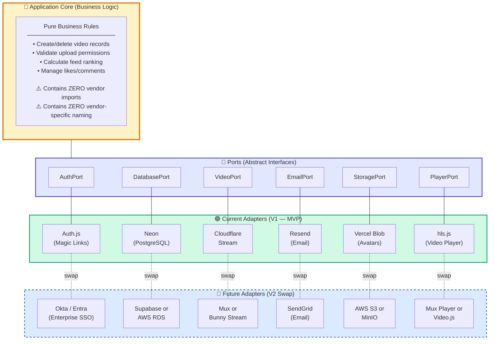
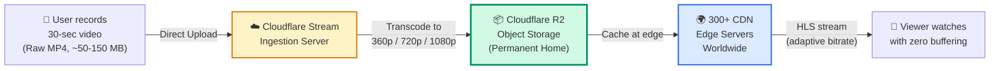
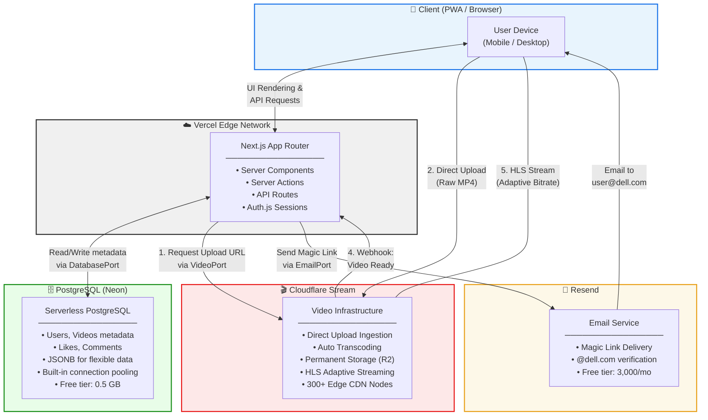
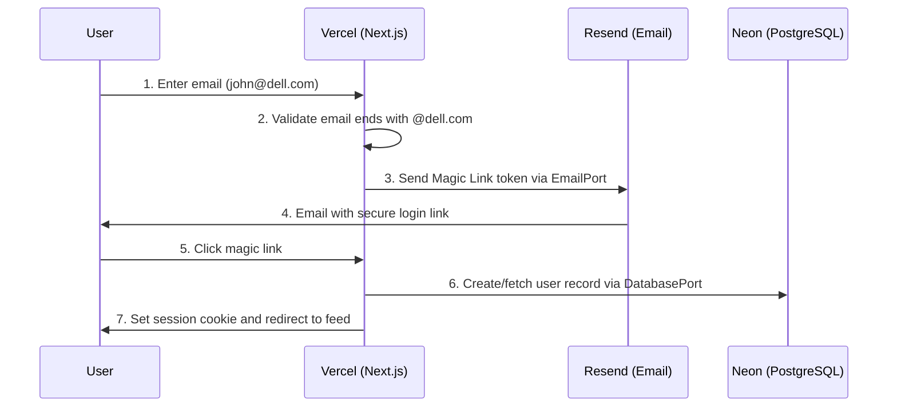
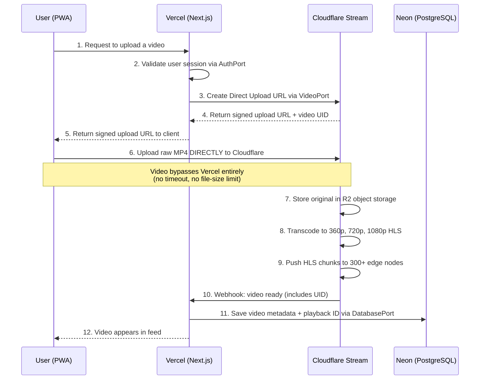
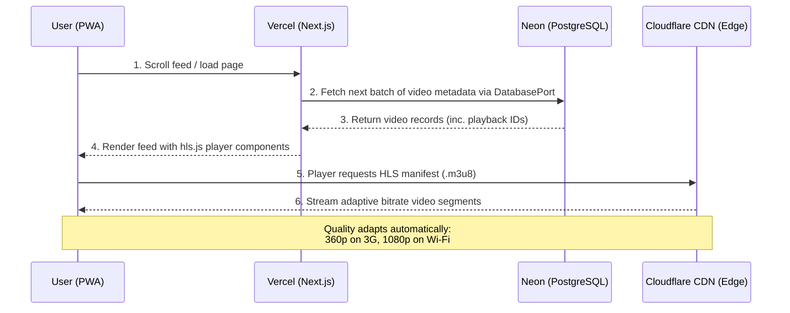
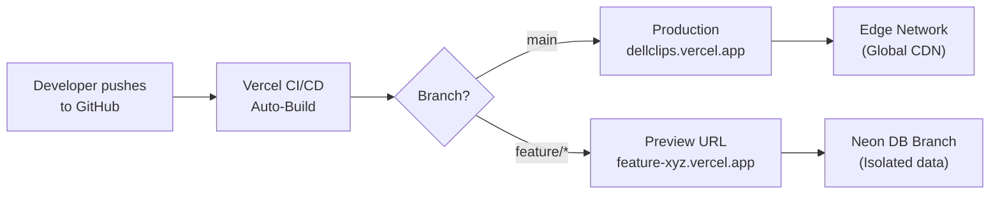

# Technical Architecture Document

## Dell Internal Short-Form Video Platform ("DellClips")

### Version 2.0

---

### 1. Architecture Overview

The application follows a **Hexagonal Architecture (Ports & Adapters)**
pattern deployed on a modern serverless infrastructure. This architecture
ensures that every external dependency — authentication, database, video
processing, email delivery — is abstracted behind an interface and can be
replaced without modifying core business logic.

**Core Design Principles:**

- **Separation of Concerns:** UI, business logic, and infrastructure are
  strictly decoupled.
- **Component Replaceability:** Every external service is accessed through
  an abstract Port (interface), with the current vendor implemented as a
  swappable Adapter. No vendor-specific naming exists in the core domain.
- **Serverless-First:** No servers to manage; compute, database, and CDN
  scale automatically.
- **Free-Tier Maximization:** The MVP stack is designed to run at near-zero
  cost (~$6-10/month) by leveraging free tiers wherever possible.
- **AI-Assisted Development:** ~90% of the codebase will be generated via
  AI coding assistants, dramatically reducing time-to-launch.

---

### 2. Hexagonal Architecture (Ports & Adapters)

The following diagram shows how the application core is completely isolated
from all external vendors. Any adapter can be replaced without touching
core business logic.



#### How Replaceability Works in Code

Each external dependency is accessed through a TypeScript interface (Port).
The concrete implementation (Adapter) is injected at the application's
composition root.

**Port (Interface) — stable contract, never changes:**

```typescript
// lib/ports/video-service.ts
export interface VideoService {
  createUploadUrl(userId: string): Promise<{
    uploadUrl: string;
    assetId: string;
  }>;
  getPlaybackUrl(assetId: string): string;
  deleteVideo(assetId: string): Promise<void>;
}
```

**Adapter (Default — Cloudflare Stream):**

```typescript
// lib/adapters/cloudflare-video-service.ts
import { VideoService } from "../ports/video-service";

export class CloudflareVideoService implements VideoService {
  private accountId = process.env.CF_ACCOUNT_ID!;
  private apiToken = process.env.CF_STREAM_TOKEN!;

  async createUploadUrl(userId: string) {
    const res = await fetch(
      `https://api.cloudflare.com/client/v4/accounts/${this.accountId}/stream/direct_upload`,
      {
        method: "POST",
        headers: { Authorization: `Bearer ${this.apiToken}` },
        body: JSON.stringify({
          maxDurationSeconds: 60,
          meta: { userId },
        }),
      }
    );
    const data = await res.json();
    return {
      uploadUrl: data.result.uploadURL,
      assetId: data.result.uid,
    };
  }

  getPlaybackUrl(assetId: string) {
    return `https://customer-${this.accountId}.cloudflarestream.com/${assetId}/manifest/video.m3u8`;
  }

  async deleteVideo(assetId: string) {
    await fetch(
      `https://api.cloudflare.com/client/v4/accounts/${this.accountId}/stream/${assetId}`,
      {
        method: "DELETE",
        headers: { Authorization: `Bearer ${this.apiToken}` },
      }
    );
  }
}
```

**Composition Root — the ONLY place vendors are referenced:**

```typescript
// lib/services.ts (Composition Root)
import { CloudflareVideoService } from "./adapters/cloudflare-video-service";
import { NeonDatabaseService } from "./adapters/neon-database-service";
import { ResendEmailService } from "./adapters/resend-email-service";

// To swap ANY provider, change ONLY the import + instantiation here.
// Zero changes to business logic, API routes, or UI components.
export const videoService = new CloudflareVideoService();
export const databaseService = new NeonDatabaseService();
export const emailService = new ResendEmailService();
```

---

### 3. Technology Stack

| Layer              | Technology              | Port Interface     | Free Tier?   | Purpose                                                 |
| :----------------- | :---------------------- | :----------------- | :----------- | :------------------------------------------------------ |
| **Framework**      | Next.js 15 (App Router) | —                  | ✅ OSS       | Full-stack React: UI + Server Actions + API Routes      |
| **Language**       | TypeScript              | —                  | ✅ OSS       | Type safety across the entire codebase                  |
| **Styling**        | Tailwind CSS            | —                  | ✅ OSS       | Utility-first CSS for rapid mobile-first UI development |
| **PWA**            | Serwist                 | —                  | ✅ OSS       | Service worker, manifest, install prompts               |
| **Authentication** | Auth.js + Resend        | `AuthPort`         | ✅ Free      | Magic Link login restricted to `@dell.com`              |
| **Database**       | PostgreSQL on Neon      | `DatabasePort`     | ✅ Free      | All relational data (users, videos, likes, comments)    |
| **ORM**            | Drizzle ORM             | (Part of DB layer) | ✅ OSS       | Type-safe queries and schema migrations                 |
| **Video Platform** | Cloudflare Stream       | `VideoPort`        | ⚠️ ~$5-10/mo | Upload, transcode, HLS adaptive streaming, global CDN   |
| **Video Player**   | hls.js (or Video.js)    | `PlayerPort`       | ✅ OSS       | Vendor-neutral HLS player; works with any HLS source    |
| **Hosting**        | Vercel                  | —                  | ✅ Free      | Zero-config deployment, edge network, auto-scaling      |
| **Email**          | Resend                  | `EmailPort`        | ✅ Free      | Transactional email for magic links (3,000/mo free)     |

---

### 4. Where Videos Are Stored

This section explains the complete lifecycle of a video file — from upload
to playback. Understanding this is critical: **your application never
stores, hosts, or serves video files.** Videos live entirely within the
video platform provider's infrastructure.

#### 4.1 Video Storage Architecture



#### 4.2 Storage Layers Explained

| Layer                 | What Lives There                                                                                      | Where Physically                                 | Managed By | You Touch It? |
| :-------------------- | :---------------------------------------------------------------------------------------------------- | :----------------------------------------------- | :--------- | :------------ |
| **Ingestion**         | Raw MP4 uploaded by user                                                                              | Video platform's upload servers                  | Cloudflare | ❌ No         |
| **Transcoding**       | Temporary processing (converting to multiple resolutions)                                             | Video platform's compute                         | Cloudflare | ❌ No         |
| **Permanent Storage** | Transcoded HLS chunks (`.ts` segments) + manifests (`.m3u8`) in 360p, 720p, 1080p                     | **Cloudflare R2** (S3-compatible object storage) | Cloudflare | ❌ No         |
| **Edge Cache**        | Cached copies of popular video chunks for fast delivery                                               | **300+ CDN edge nodes** distributed globally     | Cloudflare | ❌ No         |
| **Your Database**     | **Only metadata**: title, description, user ID, and a `playback_id` text string pointing to the video | Neon PostgreSQL                                  | You        | ✅ Yes        |

#### 4.3 What Your Database Actually Stores Per Video

```sql
-- This is ALL that lives in your database per video:
INSERT INTO videos (video_playback_id, title, user_id, status)
VALUES ('a1b2c3d4e5f6', 'My Cool Demo', 'user-uuid-here', 'ready');

-- Total storage per video record: ~0.5 KB
-- Compare to the actual video file: ~50,000 KB (50 MB)
-- Your database stores 0.001% of the total data
```

#### 4.4 The Key Insight

Your application is a **lightweight metadata layer + beautiful UI** sitting
on top of the video platform's storage and CDN infrastructure. You never
touch a video file after the user uploads it. The `video_playback_id`
string in your database is essentially a pointer — like a URL — to the
video living on the CDN.

---

### 5. Why PostgreSQL?

PostgreSQL is chosen as the primary database for the following reasons:

#### 5.1 Extensibility ("The Everything Database")

| Capability                  | PostgreSQL Feature | Separate System It Replaces |
| :-------------------------- | :----------------- | :-------------------------- |
| Relational data             | Core SQL engine    | MySQL, MariaDB              |
| Unstructured/flexible data  | JSONB columns      | MongoDB                     |
| Full-text search            | tsvector / tsquery | Elasticsearch (basic needs) |
| AI/Vector similarity search | pgvector extension | Pinecone, Weaviate          |
| Geospatial queries          | PostGIS extension  | Specialized geo databases   |

One database system instead of 3-4 separate ones.

#### 5.2 Concurrency & Performance

PostgreSQL uses **Multi-Version Concurrency Control (MVCC)**. When one user
writes a like or comment, it does not lock out other users from reading
the video feed.

#### 5.3 Reliability & Data Integrity

- **Strictly ACID-compliant**: Data consistency guaranteed even during
  crashes via Write-Ahead Logging (WAL).
- **Open source**: Zero vendor lock-in. Migrate between any PostgreSQL
  host with zero schema changes.

#### 5.4 Replaceability

All database access goes through the `DatabasePort` interface and Drizzle
ORM. Swapping from Neon to Supabase, AWS RDS, or Azure Database requires
changing only the connection string and adapter configuration.

---

### 6. Where PostgreSQL Resides

#### 6.1 Deployment Model by Environment

| Environment    | Deployment Model          | Service / Tool             |
| :------------- | :------------------------ | :------------------------- |
| **Local Dev**  | Containerized (Docker)    | `postgres:16` Docker image |
| **Staging**    | Managed DBaaS (Branching) | Neon Database Branch       |
| **Production** | Managed DBaaS             | Neon Serverless PostgreSQL |

#### 6.2 Why Managed DBaaS (Not Self-Hosted)?

| Concern               | Self-Hosted (VPS)         | Managed (Neon)              |
| :-------------------- | :------------------------ | :-------------------------- |
| OS & security patches | Your responsibility       | Automatic                   |
| Automated failover    | Must configure manually   | Built-in                    |
| Backups & PITR        | Must set up pg_basebackup | Built-in, one-click restore |
| Connection pooling    | Must deploy PgBouncer     | Built-in                    |
| Scaling               | Manual resize             | Auto scale-to-zero          |
| Cost at MVP           | ~$20-50/mo (always-on)    | $0 (free tier)              |

#### 6.3 Required PostgreSQL Infrastructure

Whether self-hosted or managed, production PostgreSQL requires:

| Layer                  | Requirement                         | Managed by Neon? |
| :--------------------- | :---------------------------------- | :--------------- |
| **Storage**            | Persistent SSD block storage        | ✅ Yes           |
| **Compute**            | Min 4 vCPUs, 16 GB RAM (production) | ✅ Yes           |
| **Connection Pooling** | PgBouncer or built-in pooler        | ✅ Yes           |
| **Backups**            | Point-in-Time Recovery (PITR)       | ✅ Yes           |
| **Replication**        | Read replicas                       | ✅ Yes           |
| **Networking**         | Private VPC / firewall rules        | ✅ Yes           |

> When using Neon, all of this is handled automatically. You receive a
> connection string and never configure infrastructure yourself.

#### 6.4 Future Migration Path

If Dell IT requires the database on Dell-managed infrastructure:

1. Export with `pg_dump`
2. Import into AWS RDS, Azure Database, or self-hosted PostgreSQL
3. Update the connection string in the `DatabasePort` adapter
4. Zero application code changes

---

### 7. System Architecture Diagram



---

### 8. Core Workflows

#### 8.1 Authentication Flow



**Key Security Measures:**

- Email domain validation: only `@dell.com` addresses accepted
- Magic link tokens expire after 10 minutes
- Sessions stored in secure, HttpOnly, SameSite cookies
- CSRF protection built into Auth.js

#### 8.2 Video Upload Flow



**Why Direct Upload?**

- Vercel serverless functions have a 4.5 MB body size limit and
  60-second execution timeout
- A 30-second 1080p video can be 50-150 MB
- Direct-to-Cloudflare upload eliminates this bottleneck

#### 8.3 Video Playback Flow



---

### 9. Database Schema

All column names are **vendor-neutral** — no references to Mux, Cloudflare,
or any specific provider. This ensures the schema remains valid regardless
of which video platform adapter is active.

```sql
-- Users table
CREATE TABLE users (
    id            UUID PRIMARY KEY DEFAULT gen_random_uuid(),
    email         VARCHAR(255) UNIQUE NOT NULL,
    name          VARCHAR(255),
    avatar_url    TEXT,
    role          VARCHAR(20) DEFAULT 'user',
    created_at    TIMESTAMP DEFAULT NOW(),
    updated_at    TIMESTAMP DEFAULT NOW()
);

-- Videos table (vendor-neutral column names)
CREATE TABLE videos (
    id               UUID PRIMARY KEY DEFAULT gen_random_uuid(),
    user_id          UUID NOT NULL REFERENCES users(id) ON DELETE CASCADE,
    title            VARCHAR(500),
    description      TEXT,
    video_asset_id   VARCHAR(255) UNIQUE NOT NULL,
    video_playback_id VARCHAR(255) UNIQUE NOT NULL,
    video_upload_id  VARCHAR(255),
    status           VARCHAR(20) DEFAULT 'processing',
    duration         FLOAT,
    like_count       INTEGER DEFAULT 0,
    comment_count    INTEGER DEFAULT 0,
    search_vector    TSVECTOR,
    created_at       TIMESTAMP DEFAULT NOW()
);

-- Likes table
CREATE TABLE likes (
    id          UUID PRIMARY KEY DEFAULT gen_random_uuid(),
    user_id     UUID NOT NULL REFERENCES users(id) ON DELETE CASCADE,
    video_id    UUID NOT NULL REFERENCES videos(id) ON DELETE CASCADE,
    created_at  TIMESTAMP DEFAULT NOW(),
    UNIQUE(user_id, video_id)
);

-- Comments table
CREATE TABLE comments (
    id          UUID PRIMARY KEY DEFAULT gen_random_uuid(),
    user_id     UUID NOT NULL REFERENCES users(id) ON DELETE CASCADE,
    video_id    UUID NOT NULL REFERENCES videos(id) ON DELETE CASCADE,
    text        TEXT NOT NULL,
    created_at  TIMESTAMP DEFAULT NOW()
);
-- Reports table (user-driven content moderation)
CREATE TABLE reports (
    id          UUID PRIMARY KEY DEFAULT gen_random_uuid(),
    user_id     UUID NOT NULL REFERENCES users(id) ON DELETE CASCADE,
    video_id    UUID NOT NULL REFERENCES videos(id) ON DELETE CASCADE,
    reason      VARCHAR(50) NOT NULL,
    description TEXT,
    status      VARCHAR(20) DEFAULT 'pending' NOT NULL,
    reviewed_by UUID REFERENCES users(id),
    reviewed_at TIMESTAMP,
    created_at  TIMESTAMP DEFAULT NOW()
);

-- Follows table (user-to-user subscriptions)
CREATE TABLE follows (
    id            UUID PRIMARY KEY DEFAULT gen_random_uuid(),
    follower_id   UUID NOT NULL REFERENCES users(id) ON DELETE CASCADE,
    following_id  UUID NOT NULL REFERENCES users(id) ON DELETE CASCADE,
    created_at    TIMESTAMP DEFAULT NOW(),
    UNIQUE(follower_id, following_id)
);

-- Hashtags table
CREATE TABLE hashtags (
    id          UUID PRIMARY KEY DEFAULT gen_random_uuid(),
    name        VARCHAR(100) UNIQUE NOT NULL,
    created_at  TIMESTAMP DEFAULT NOW()
);

-- Video-Hashtag junction table (many-to-many)
CREATE TABLE video_hashtags (
    id          UUID PRIMARY KEY DEFAULT gen_random_uuid(),
    video_id    UUID NOT NULL REFERENCES videos(id) ON DELETE CASCADE,
    hashtag_id  UUID NOT NULL REFERENCES hashtags(id) ON DELETE CASCADE,
    UNIQUE(video_id, hashtag_id)
);

-- Additional indexes
CREATE INDEX idx_reports_video_id ON reports(video_id);
CREATE INDEX idx_reports_status ON reports(status);
CREATE INDEX idx_follows_follower ON follows(follower_id);
CREATE INDEX idx_follows_following ON follows(following_id);
CREATE INDEX idx_hashtags_name ON hashtags(name);
CREATE INDEX idx_video_hashtags_video ON video_hashtags(video_id);
CREATE INDEX idx_video_hashtags_hashtag ON video_hashtags(hashtag_id);
CREATE INDEX idx_videos_search ON videos USING GIN(search_vector);
-- Indexes for performance
CREATE INDEX idx_videos_user_id ON videos(user_id);
CREATE INDEX idx_videos_status ON videos(status);
CREATE INDEX idx_videos_created_at ON videos(created_at DESC);
CREATE INDEX idx_likes_video_id ON likes(video_id);
CREATE INDEX idx_comments_video_id ON comments(video_id);
CREATE INDEX idx_comments_created_at ON comments(created_at DESC);
```

**Entity Relationship Diagram:**

```mermaid
erDiagram
    USERS ||--o{ VIDEOS : uploads
    USERS ||--o{ LIKES : gives
    USERS ||--o{ COMMENTS : writes
    USERS ||--o{ REPORTS : submits
    USERS ||--o{ FOLLOWS : follows
    USERS ||--o{ FOLLOWS : "is followed by"
    VIDEOS ||--o{ LIKES : receives
    VIDEOS ||--o{ COMMENTS : receives
    VIDEOS ||--o{ REPORTS : "is reported in"
    VIDEOS ||--o{ VIDEO_HASHTAGS : tagged_with
    HASHTAGS ||--o{ VIDEO_HASHTAGS : applied_to

    USERS {
        uuid id PK
        string email UK
        string name
        string avatar_url
        string role
        timestamp created_at
    }

    VIDEOS {
        uuid id PK
        uuid user_id FK
        string title
        string video_playback_id UK
        string status
        float duration
        int like_count
        int comment_count
        tsvector search_vector
        timestamp created_at
    }

    LIKES {
        uuid id PK
        uuid user_id FK
        uuid video_id FK
        timestamp created_at
    }

    COMMENTS {
        uuid id PK
        uuid user_id FK
        uuid video_id FK
        string text
        timestamp created_at
    }

    REPORTS {
        uuid id PK
        uuid user_id FK
        uuid video_id FK
        string reason
        string description
        string status
        uuid reviewed_by FK
        timestamp created_at
    }

    FOLLOWS {
        uuid id PK
        uuid follower_id FK
        uuid following_id FK
        timestamp created_at
    }

    HASHTAGS {
        uuid id PK
        string name UK
        timestamp created_at
    }

    VIDEO_HASHTAGS {
        uuid id PK
        uuid video_id FK
        uuid hashtag_id FK
    }
```



---

### 10. Project Structure (Next.js App Router + Hexagonal)

```
dellclips/
├── app/
│   ├── layout.tsx
│   ├── manifest.ts
│   ├── page.tsx
│   ├── (auth)/
│   │   ├── login/page.tsx
│   │   └── verify/page.tsx
│   ├── (app)/
│   │   ├── layout.tsx
│   │   ├── feed/page.tsx
│   │   ├── upload/page.tsx
│   │   └── profile/[id]/page.tsx
│   └── api/
│       ├── auth/[...nextauth]/
│       ├── video/
│       │   ├── upload-url/route.ts
│       │   └── webhook/route.ts
│       └── videos/
│           ├── route.ts
│           └── [id]/
│               ├── like/route.ts
│               └── comments/route.ts
│       ├── videos/
│       │   ├── route.ts
│       │   ├── search/route.ts         # GET search by title/hashtag
│       │   └── [id]/
│       │       ├── like/route.ts
│       │       ├── comments/route.ts
│       │       └── report/route.ts     # POST report a video
│       ├── users/
│       │   └── [id]/
│       │       └── follow/route.ts     # POST/DELETE follow a user
│       └── hashtags/
│           └── route.ts                # GET trending hashtags
│
├── lib/
│   ├── ports/                              # Abstract Interfaces (stable)
│   │   ├── auth-service.ts                 #   AuthPort interface
│   │   ├── database-service.ts             #   DatabasePort interface
│   │   ├── video-service.ts                #   VideoPort interface
│   │   ├── email-service.ts                #   EmailPort interface
│   │   └── player-config.ts                #   PlayerPort interface
│   │
│   ├── adapters/                           # Vendor Implementations (swappable)
│   │   ├── authjs-auth-service.ts          #   Auth.js Magic Link adapter
│   │   ├── neon-database-service.ts        #   Neon + Drizzle adapter
│   │   ├── cloudflare-video-service.ts     #   Cloudflare Stream adapter
│   │   └── resend-email-service.ts         #   Resend adapter
│   │
│   ├── services.ts                         # Composition Root (swap vendors here)
│   └── utils.ts
│
├── components/
│   ├── video-player.tsx               # Uses hls.js
│   ├── video-card.tsx
│   ├── video-feed.tsx
│   ├── upload-form.tsx
│   ├── comment-section.tsx
│   ├── report-dialog.tsx              # Report video modal
│   ├── follow-button.tsx              # Follow/unfollow toggle
│   ├── hashtag-input.tsx              # Hashtag picker for uploads
│   ├── search-bar.tsx                 # Search by title/hashtag
│   └── nav-bar.tsx
│
├── drizzle/
│   └── schema.ts
│
├── public/
│   ├── icons/
│   └── sw.js
│
├── docker-compose.yml                      # Local dev PostgreSQL
├── tailwind.config.ts
├── next.config.ts
├── package.json
└── tsconfig.json
```

---

### 11. Key Design Decisions

| Decision                                | Rationale                                                                                                                                                          |
| :-------------------------------------- | :----------------------------------------------------------------------------------------------------------------------------------------------------------------- |
| **Hexagonal Architecture**              | Every external service is behind an interface. Swapping vendors requires changing one adapter + one line in the composition root.                                  |
| **Vendor-Neutral Naming**               | Database columns use `video_asset_id` / `video_playback_id` instead of `mux_asset_id`. API routes use `/video/` not `/mux/`. No vendor names leak into the domain. |
| **Cloudflare Stream over Mux (MVP)**    | Cloudflare Stream starts at ~$5/mo vs Mux's higher entry price. Both provide transcoding + HLS + CDN. Mux can be swapped in later via a new adapter.               |
| **hls.js over vendor-specific players** | hls.js is open-source and works with ANY HLS source (Cloudflare, Mux, Bunny, self-hosted). No player lock-in.                                                      |
| **PWA over Native Apps**                | Eliminates App Store / Play Store approval; single codebase for all platforms.                                                                                     |
| **PostgreSQL over NoSQL**               | One database handles relational data, JSONB, full-text search, and future vector search. ACID-compliant, open-source, zero vendor lock-in.                         |
| **Neon over self-hosted PostgreSQL**    | Serverless auto-scaling, built-in pooling and PITR, database branching. Free tier covers MVP entirely.                                                             |
| **Direct-to-CDN Upload**                | Avoids Vercel's 4.5 MB body limit and 60s timeout. Videos go straight from browser to Cloudflare.                                                                  |
| **Magic Links over Enterprise SSO**     | 10x faster for MVP. SSO added later via a new AuthPort adapter.                                                                                                    |
| **AI-Assisted Development**             | ~90% of code generated via AI. Reduces 4-6 week traditional timeline to 1-2 weeks.                                                                                 |

---

### 12. Infrastructure & Cost Estimates (MVP)

| Service               | Free Tier Available?     | MVP Monthly Cost           |
| :-------------------- | :----------------------- | :------------------------- |
| **Vercel**            | ✅ Yes (100 GB BW)       | **$0**                     |
| **Neon PostgreSQL**   | ✅ Yes (0.5 GB, 190 hrs) | **$0**                     |
| **Auth.js**           | ✅ Yes (OSS)             | **$0**                     |
| **Resend**            | ✅ Yes (3,000 emails/mo) | **$0**                     |
| **Serwist (PWA)**     | ✅ Yes (OSS)             | **$0**                     |
| **Drizzle ORM**       | ✅ Yes (OSS)             | **$0**                     |
| **hls.js**            | ✅ Yes (OSS)             | **$0**                     |
| **Cloudflare Stream** | ❌ No (pay-as-you-go)    | **~$5-10**                 |
| **Domain**            | is-a.dev (free subdomain)| **$0**                    |
| **TOTAL**             |                          | **~$5-10/month**           |

#### Cost Scaling Projections

| Scale            | Videos Stored | Monthly Views | Est. Monthly Cost |
| :--------------- | :------------ | :------------ | :---------------- |
| **MVP (Pilot)**  | 50            | 500           | ~$6-10            |
| **Departmental** | 500           | 5,000         | ~$15-30           |
| **Company-wide** | 5,000         | 50,000        | ~$80-150          |

---

### 13. Deployment & CI/CD



- Every push to `main` triggers automatic production deployment
- Every pull request gets a unique Preview URL
- Each preview URL can connect to its own Neon database branch
- Zero-downtime deployments with instant rollback
- Environment variables managed securely in Vercel dashboard

---

### 14. Security Considerations

| Concern                  | Mitigation                                                         |
| :----------------------- | :----------------------------------------------------------------- |
| **Unauthorized Access**  | Email domain validation (`@dell.com` only) at authentication layer |
| **Session Hijacking**    | HttpOnly, Secure, SameSite=Strict cookies; short-lived JWT tokens  |
| **Video Access Control** | Cloudflare Signed URLs (V2) to prevent unauthorized video sharing  |
| **CSRF Attacks**         | Built-in CSRF protection via Auth.js                               |
| **Webhook Spoofing**     | Cloudflare webhook signature verification on all incoming requests |
| **SQL Injection**        | Parameterized queries via Drizzle ORM; no raw string concatenation |
| **File Upload Abuse**    | File type validation (video/mp4, video/webm only); 200 MB size cap |
| **Rate Limiting**        | Vercel Edge Middleware rate limiting on auth and upload endpoints  |
| **Database Exposure**    | PostgreSQL accessible only via private connection; no public IP    |

---

#### 15. Development Timeline (AI-Assisted)

The following timeline assumes ~90% of code is AI-generated with human
guidance, review, and real-device testing.

| Day       | Milestone                                                           |
| :-------- | :------------------------------------------------------------------ |
| Day 1-2   | Account setup (Vercel, Neon, Cloudflare, Resend), project scaffold  |
| Day 3-4   | Auth.js Magic Links + email domain validation + PWA manifest        |
| Day 5-7   | Cloudflare Stream integration (upload + webhook + playback)         |
| Day 8-9   | Video feed UI (TikTok-style vertical scroll with hls.js)            |
| Day 10-11 | Likes, Comments, User Profiles                                      |
| Day 12-13 | Report Video feature (report dialog + API + DB)                     |
| Day 14-15 | Follow/Subscribe (follow button + feed personalization)             |
| Day 16-17 | Hashtags & Search (hashtag input on upload + search bar + tsvector) |
| Day 18-19 | Responsive polish, mobile PWA testing on real devices               |
| Day 20    | Internal soft launch with pilot group                               |

**Total estimated MVP delivery: ~3 weeks** with 1 engineer + AI.

_Note: Timeline increased from 2 weeks to 3 weeks due to the addition
of Report Video, Follow/Subscribe, and Hashtags/Search to Phase 1 MVP
scope._

---

### 16. Component Replacement Guide

| Component            | Current Adapter       | How to Replace                                                                                                                         |
| :------------------- | :-------------------- | :------------------------------------------------------------------------------------------------------------------------------------- |
| **Authentication**   | Auth.js (Magic Links) | Create new adapter implementing `AuthPort`, update `lib/services.ts`. No other changes.                                                |
| **Database**         | Neon (PostgreSQL)     | Spin up new PostgreSQL instance, run `drizzle-kit push`, update connection string in adapter. Zero app code changes.                   |
| **Video CDN**        | Cloudflare Stream     | Create new adapter implementing `VideoPort`, update `lib/services.ts`, update webhook endpoint to parse new provider's payload format. |
| **Video Player**     | hls.js                | Swap to Video.js, Mux Player, or Plyr. Update the `video-player.tsx` component. Feed and API remain unchanged.                         |
| **Email**            | Resend                | Create new adapter implementing `EmailPort`, update `lib/services.ts`. No other changes.                                               |
| **Hosting**          | Vercel                | Next.js deploys to Netlify, AWS Amplify, Cloudflare Pages, or self-hosted Node.js with zero framework changes.                         |
| **ORM**              | Drizzle               | Swap to Prisma or Kysely. Only the `DatabasePort` adapter internals change.                                                            |
| **Full Self-Hosted** | N/A (future)          | Video: MinIO (object storage) + FFmpeg (transcode) + Nginx (CDN). DB: Self-hosted PostgreSQL. Auth: Keycloak. All via new adapters.    |

---

### 17. Future Architecture Considerations (V2+)

- **Enterprise SSO:** Add Okta/Microsoft Entra provider via a new
  `AuthPort` adapter.
- **Upgrade Video Provider:** Swap Cloudflare Stream for Mux when budget
  allows — Mux offers superior analytics, AI captions, and moderation.
- **Real-Time Features:** WebSocket support for live comment updates
  via Pusher, Ably, or Vercel's native WebSocket support.
- **Content Moderation:** AI-based moderation before publishing.
- **Analytics Dashboard:** Video engagement metrics for leadership.
- **Multi-Region Database:** Neon read replicas for global latency
  optimization.
- **Self-Hosted Fallback:** If Dell IT requires on-premises video
  infrastructure, deploy MinIO (S3-compatible object storage) + FFmpeg
  (transcoding) + Nginx (caching/CDN) on Dell servers. The `VideoPort`
  interface ensures this is an adapter swap, not a rewrite.
  - **Video Platform Migration Path:**
  - **Current (MVP):** Cloudflare Stream (~$5-10/mo, single API)
  - **Scale:** Mux (superior analytics, AI captions, ~$50-100/mo)
  - **Enterprise/IT-mandated:** AWS S3 + MediaConvert + CloudFront
    (~$85-90/mo, requires 4-5 services). See HLD Appendix A for full
    AWS architecture diagram and cost breakdown.
  - **Self-hosted:** MinIO + FFmpeg + Nginx (maximum control, highest
    DevOps effort)
  - All migrations require only a new `VideoPort` adapter + one-line
    change in composition root. Zero application code changes.
