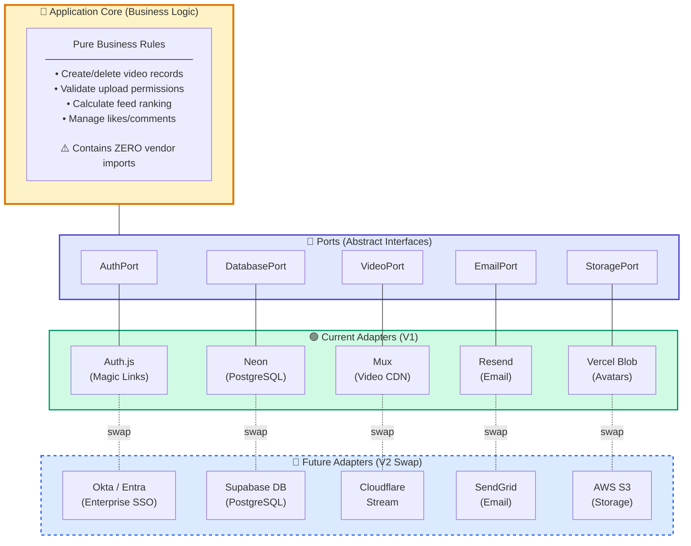
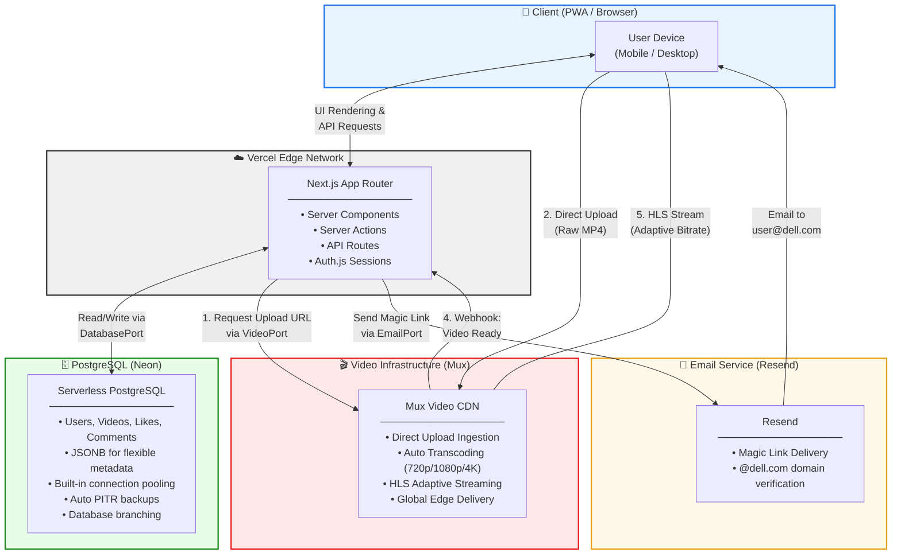
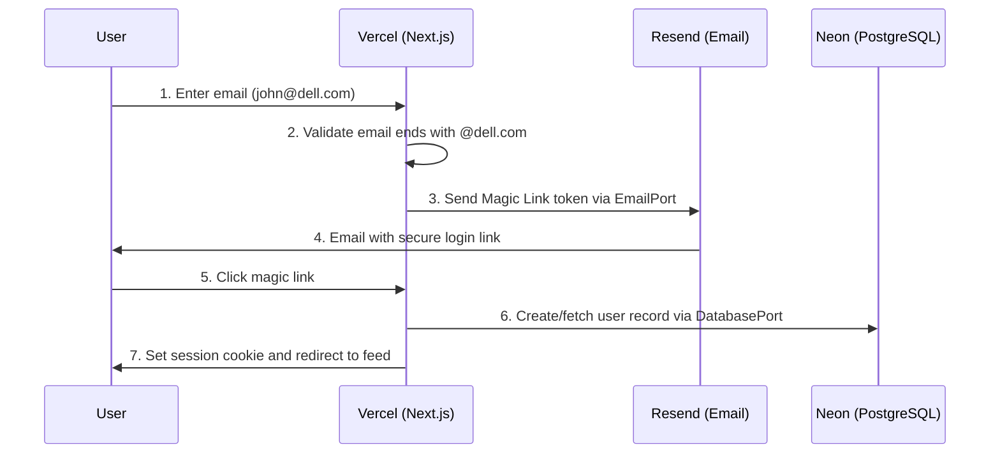
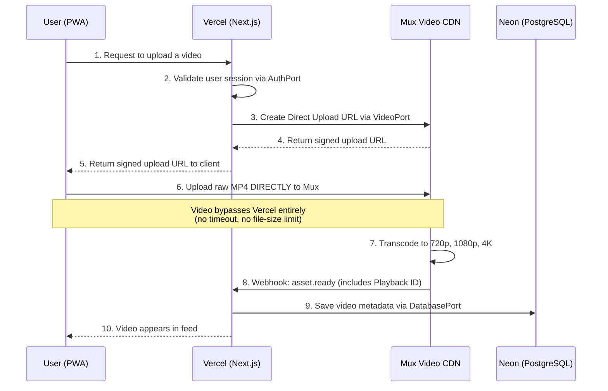
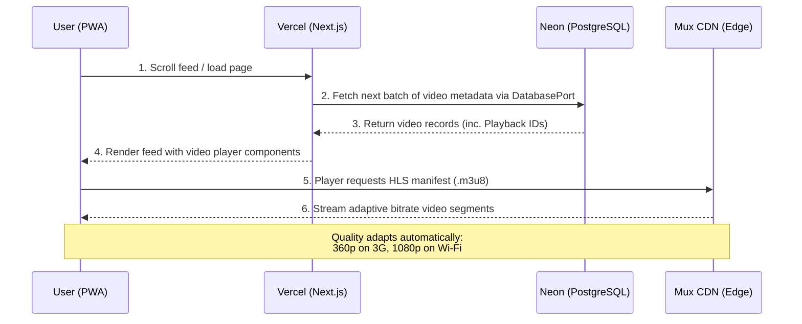
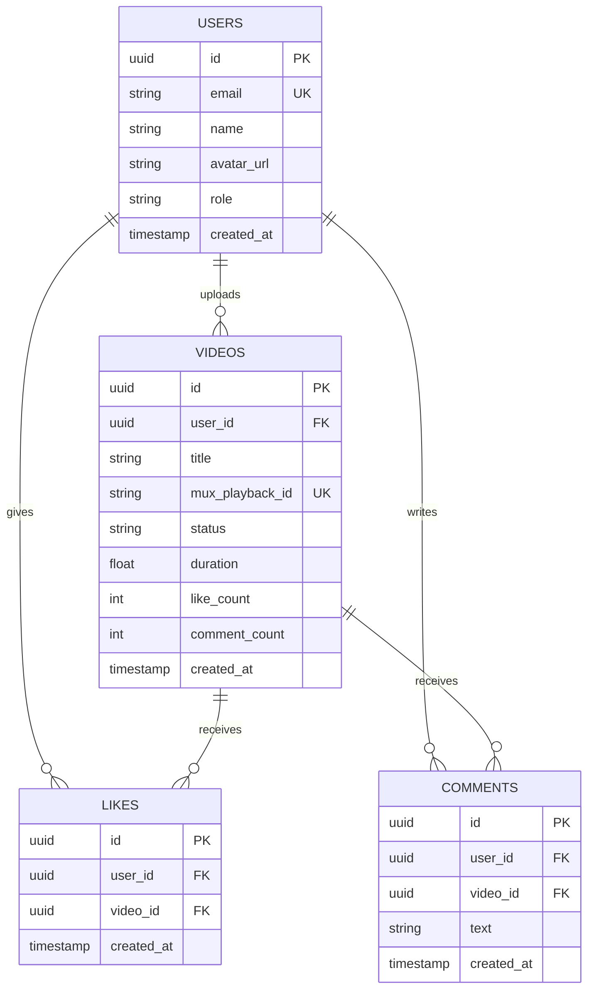
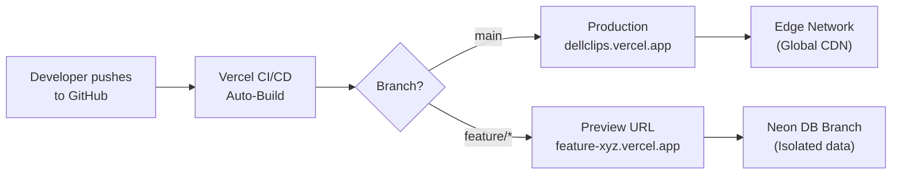

# Technical Architecture Document
## Dell Internal Short-Form Video Platform ("DellClips")

---

### 1. Architecture Overview

The application follows a **Hexagonal Architecture (Ports & Adapters)**
pattern deployed on a modern serverless infrastructure. This architecture
ensures that every external dependency — authentication, database, video
processing, email delivery — is abstracted behind an interface and can be
replaced without modifying core business logic.

**Core Design Principles:**
- **Separation of Concerns:** UI, business logic, and infrastructure are
  strictly decoupled.
- **Component Replaceability:** Every external service is accessed through
  an abstract Port (interface), with the current vendor implemented as a
  swappable Adapter.
- **Serverless-First:** No servers to manage; compute, database, and CDN
  scale automatically.

---

### 2. Hexagonal Architecture (Ports & Adapters)

The following diagram shows how the application core is completely isolated
from all external vendors. Any adapter can be replaced without touching
core business logic.



#### How Replaceability Works in Code

Each external dependency is accessed through a TypeScript interface (Port).
The concrete implementation (Adapter) is injected at the application's
composition root.

**Port (Interface) — stable contract, never changes:**

```typescript
// lib/ports/video-service.ts
export interface VideoService {
  createUploadUrl(userId: string): Promise<{
    uploadUrl: string;
    assetId: string;
  }>;
  getPlaybackUrl(assetId: string): string;
  deleteVideo(assetId: string): Promise<void>;
}
```

**Adapter (Implementation) — swappable per vendor:**

```typescript
// lib/adapters/mux-video-service.ts
import { VideoService } from '../ports/video-service';

export class MuxVideoService implements VideoService {
  async createUploadUrl(userId: string) { /* Mux API calls */ }
  getPlaybackUrl(assetId: string) { /* Mux URL format */ }
  async deleteVideo(assetId: string) { /* Mux delete API */ }
}
```

**Composition Root — the ONLY place vendors are referenced:**

```typescript
// lib/services.ts (Composition Root)
import { MuxVideoService } from './adapters/mux-video-service';
import { NeonDatabaseService } from './adapters/neon-database-service';
import { ResendEmailService } from './adapters/resend-email-service';

// To swap Mux for Cloudflare, change ONLY this file:
export const videoService = new MuxVideoService();
export const databaseService = new NeonDatabaseService();
export const emailService = new ResendEmailService();
```

**Swap Example — switching from Mux to Cloudflare Stream:**
1. Create `lib/adapters/cloudflare-video-service.ts` implementing
   `VideoService`
2. Change one line in `lib/services.ts`:
   `export const videoService = new CloudflareVideoService();`
3. Zero changes to any business logic, API routes, or UI components.

---

### 3. Technology Stack

| Layer              | Technology                  | Port Interface     | Purpose                                                            |
| :----------------- | :-------------------------- | :----------------- | :----------------------------------------------------------------- |
| **Framework**      | Next.js 15 (App Router)     | —                  | Full-stack React framework: UI + Server Actions + API Routes       |
| **Language**       | TypeScript                  | —                  | Type safety across the entire codebase                             |
| **Styling**        | Tailwind CSS                | —                  | Utility-first CSS for rapid mobile-first UI development            |
| **PWA**            | Serwist                     | —                  | Service worker, manifest, install prompts                          |
| **Authentication** | Auth.js + Resend            | `AuthPort`         | Magic Link login restricted to `@dell.com`                         |
| **Database**       | PostgreSQL on Neon          | `DatabasePort`     | All relational data (users, videos, likes, comments)               |
| **ORM**            | Drizzle ORM                 | (Part of DB layer) | Type-safe queries and schema migrations                            |
| **Video Platform** | Mux Video                   | `VideoPort`        | Upload, transcode, HLS adaptive streaming, global CDN              |
| **Video Player**   | `@mux/mux-player-react`     | `PlayerPort`       | Drop-in React component (swappable to Video.js, hls.js, etc.)     |
| **Hosting**        | Vercel                      | —                  | Zero-config deployment, edge network, auto-scaling                 |
| **Email**          | Resend                      | `EmailPort`        | Transactional email for magic links                                |

---

### 4. Why PostgreSQL?

PostgreSQL is chosen as the primary database for the following reasons:

#### 4.1 Extensibility ("The Everything Database")

PostgreSQL is not just a relational database. Its architecture allows it
to serve as multiple database types simultaneously:

| Capability                      | PostgreSQL Feature        | Separate System It Replaces    |
| :------------------------------ | :------------------------ | :----------------------------- |
| Relational data                 | Core SQL engine           | MySQL, MariaDB                 |
| Unstructured/flexible data      | JSONB columns             | MongoDB                        |
| Full-text search                | tsvector / tsquery        | Elasticsearch (basic needs)    |
| AI/Vector similarity search     | pgvector extension        | Pinecone, Weaviate             |
| Geospatial queries              | PostGIS extension         | Specialized geo databases      |

This means we maintain **one database system** instead of 3-4 separate ones.

#### 4.2 Concurrency & Performance

PostgreSQL uses **Multi-Version Concurrency Control (MVCC)**. When one user
writes a like or comment, it does **not** lock out other users from reading
the video feed. This is critical for a high-traffic, real-time-feeling
application.

#### 4.3 Reliability & Data Integrity

- **Strictly ACID-compliant**: Data consistency is guaranteed even during
  system crashes, via Write-Ahead Logging (WAL).
- **Open source**: Zero vendor lock-in. You can migrate between any
  PostgreSQL-compatible host (Neon, Supabase, AWS RDS, self-hosted)
  with zero schema changes.

#### 4.4 Replaceability

Because all database access goes through the `DatabasePort` interface and
Drizzle ORM, swapping from Neon to Supabase, AWS RDS, or Azure Database
requires changing only the connection string and adapter configuration.
The ORM-generated SQL is standard PostgreSQL and works identically across
all providers.

---

### 5. Where PostgreSQL Resides

#### 5.1 Deployment Model by Environment

| Environment        | Deployment Model            | Service / Tool                 | Why                                                          |
| :----------------- | :-------------------------- | :----------------------------- | :----------------------------------------------------------- |
| **Local Dev**      | Containerized (Docker)      | `postgres:16` Docker image     | Instant setup, disposable, matches production schema         |
| **Staging**        | Managed DBaaS (Branching)   | Neon Database Branch           | Free branch per preview deploy; isolated test data           |
| **Production**     | Managed DBaaS               | **Neon Serverless PostgreSQL** | Auto-scaling, built-in pooling, zero idle cost               |

#### 5.2 Why Managed DBaaS (Not Self-Hosted)?

| Concern                     | Self-Hosted (VPS)                      | Managed (Neon / Supabase)               |
| :-------------------------- | :------------------------------------- | :-------------------------------------- |
| OS & security patches       | Your team's responsibility             | Handled automatically by provider       |
| Automated failover          | Must configure manually (Patroni, etc.)| Built-in, automatic                     |
| Backups & PITR              | Must set up and monitor pg_basebackup  | Built-in, one-click restore             |
| Connection pooling           | Must deploy and manage PgBouncer       | Built-in to the service                 |
| Scaling                     | Manual vertical scaling (resize VPS)   | Automatic scale-to-zero and scale-up    |
| Cost at MVP scale           | ~$20-50/mo for always-on VPS           | $0-19/mo (scales to zero when idle)     |

**Recommendation:** Use **Neon** for production. It is purpose-built for
serverless applications on Vercel, includes built-in connection pooling,
and supports database branching (like Git branches for your database),
which maps perfectly to Vercel's preview deployment model.

#### 5.3 Future Migration Path

If Dell IT requires the database to run on Dell-managed infrastructure:

1. Export the schema and data using `pg_dump`
2. Import into AWS RDS, Azure Database for PostgreSQL, or a self-hosted
   instance
3. Update the connection string in the `DatabasePort` adapter
4. Zero application code changes required

---

### 6. Required Infrastructure for PostgreSQL

Whether self-hosted or managed, a production PostgreSQL deployment requires
the following foundational infrastructure:

| Layer                  | Requirement                          | Details                                                                                        |
| :--------------------- | :----------------------------------- | :--------------------------------------------------------------------------------------------- |
| **Storage**            | Persistent SSD block storage         | SSDs are mandatory for high IOPS. Network File Systems (NFS) are not recommended.              |
| **Compute**            | Min 4 vCPUs, 16 GB RAM (production)  | PostgreSQL uses a process-per-connection model; each active connection consumes memory.         |
| **Connection Pooling** | PgBouncer or built-in pooler         | Prevents the database from being overwhelmed by concurrent serverless function invocations.     |
| **Backups**            | Automated Point-in-Time Recovery     | Ability to restore to any second in time, not just nightly snapshots.                          |
| **Replication**        | Read replicas                        | Feed reads (high volume) route to replicas; writes go to the primary.                          |
| **Networking**         | Private VPC / firewall rules         | Database must never be publicly accessible; only the application servers connect.              |
| **Monitoring**         | Query performance tracking           | Slow query logs, connection count monitoring, disk usage alerts.                               |

> **Key Insight:** When using a managed service like Neon, **all of the
> above is handled for you automatically**. You receive an optimized
> connection string and never configure SSDs, PgBouncer, PITR, or
> replication yourself. This is why DBaaS is strongly recommended for
> a small team.

---

### 7. System Architecture Diagram



---

### 8. Core Workflows

#### 8.1 Authentication Flow



**Key Security Measures:**
- Email domain validation: only `@dell.com` addresses accepted
- Magic link tokens expire after 10 minutes
- Sessions stored in secure, HttpOnly, SameSite cookies
- CSRF protection built into Auth.js
- **Replaceability:** Swap to Okta/Entra SSO by writing a new `AuthPort`
  adapter — zero changes to any other part of the system

#### 8.2 Video Upload Flow



**Why Direct Upload?**
- Vercel serverless functions have a 4.5 MB body size limit and a
  60-second execution timeout
- A 30-second 1080p video can easily be 50-150 MB
- Direct-to-Mux upload eliminates this bottleneck entirely
- **Replaceability:** Swap Mux for Cloudflare Stream by writing a new
  `VideoPort` adapter — the upload flow logic remains identical

#### 8.3 Video Playback Flow



---

### 9. Database Schema

```sql
-- Users table
CREATE TABLE users (
    id            UUID PRIMARY KEY DEFAULT gen_random_uuid(),
    email         VARCHAR(255) UNIQUE NOT NULL,
    name          VARCHAR(255),
    avatar_url    TEXT,
    role          VARCHAR(20) DEFAULT 'user',
    created_at    TIMESTAMP DEFAULT NOW(),
    updated_at    TIMESTAMP DEFAULT NOW()
);

-- Videos table
CREATE TABLE videos (
    id              UUID PRIMARY KEY DEFAULT gen_random_uuid(),
    user_id         UUID NOT NULL REFERENCES users(id) ON DELETE CASCADE,
    title           VARCHAR(500),
    description     TEXT,
    mux_asset_id    VARCHAR(255) UNIQUE NOT NULL,
    mux_playback_id VARCHAR(255) UNIQUE NOT NULL,
    mux_upload_id   VARCHAR(255),
    status          VARCHAR(20) DEFAULT 'processing',
    duration        FLOAT,
    like_count      INTEGER DEFAULT 0,
    comment_count   INTEGER DEFAULT 0,
    created_at      TIMESTAMP DEFAULT NOW()
);

-- Likes table
CREATE TABLE likes (
    id          UUID PRIMARY KEY DEFAULT gen_random_uuid(),
    user_id     UUID NOT NULL REFERENCES users(id) ON DELETE CASCADE,
    video_id    UUID NOT NULL REFERENCES videos(id) ON DELETE CASCADE,
    created_at  TIMESTAMP DEFAULT NOW(),
    UNIQUE(user_id, video_id)
);

-- Comments table
CREATE TABLE comments (
    id          UUID PRIMARY KEY DEFAULT gen_random_uuid(),
    user_id     UUID NOT NULL REFERENCES users(id) ON DELETE CASCADE,
    video_id    UUID NOT NULL REFERENCES videos(id) ON DELETE CASCADE,
    text        TEXT NOT NULL,
    created_at  TIMESTAMP DEFAULT NOW()
);

-- Indexes for performance
CREATE INDEX idx_videos_user_id ON videos(user_id);
CREATE INDEX idx_videos_status ON videos(status);
CREATE INDEX idx_videos_created_at ON videos(created_at DESC);
CREATE INDEX idx_likes_video_id ON likes(video_id);
CREATE INDEX idx_comments_video_id ON comments(video_id);
CREATE INDEX idx_comments_created_at ON comments(created_at DESC);
```

**Entity Relationship Diagram:**



---

### 10. Project Structure (Next.js App Router + Hexagonal)

```
dellclips/
├── app/
│   ├── layout.tsx
│   ├── manifest.ts
│   ├── page.tsx
│   ├── (auth)/
│   │   ├── login/page.tsx
│   │   └── verify/page.tsx
│   ├── (app)/
│   │   ├── layout.tsx
│   │   ├── feed/page.tsx
│   │   ├── upload/page.tsx
│   │   └── profile/[id]/page.tsx
│   └── api/
│       ├── auth/[...nextauth]/
│       ├── mux/
│       │   ├── upload-url/route.ts
│       │   └── webhook/route.ts
│       └── videos/
│           ├── route.ts
│           └── [id]/
│               ├── like/route.ts
│               └── comments/route.ts
│
├── lib/
│   ├── ports/                      # ← Abstract Interfaces (stable)
│   │   ├── auth-service.ts         #   AuthPort interface
│   │   ├── database-service.ts     #   DatabasePort interface
│   │   ├── video-service.ts        #   VideoPort interface
│   │   └── email-service.ts        #   EmailPort interface
│   │
│   ├── adapters/                   # ← Vendor Implementations (swappable)
│   │   ├── authjs-auth-service.ts  #   Auth.js adapter
│   │   ├── neon-database-service.ts#   Neon/Drizzle adapter
│   │   ├── mux-video-service.ts    #   Mux adapter
│   │   └── resend-email-service.ts #   Resend adapter
│   │
│   ├── services.ts                 # ← Composition Root (swap vendors here)
│   └── utils.ts
│
├── components/
│   ├── video-player.tsx
│   ├── video-card.tsx
│   ├── video-feed.tsx
│   ├── upload-form.tsx
│   ├── comment-section.tsx
│   └── nav-bar.tsx
│
├── drizzle/
│   └── schema.ts
│
├── public/
│   ├── icons/
│   └── sw.js
│
├── docker-compose.yml              # ← Local dev PostgreSQL
├── tailwind.config.ts
├── next.config.ts
├── package.json
└── tsconfig.json
```

Key difference from the previous version: the `lib/ports/` and
`lib/adapters/` directories enforce the Hexagonal Architecture pattern.
All vendor-specific code is isolated in adapters.

---

### 11. Key Design Decisions

| Decision                                | Rationale                                                                                                      |
| :-------------------------------------- | :------------------------------------------------------------------------------------------------------------- |
| **Hexagonal Architecture**              | Every external service is behind an interface. Swapping vendors requires changing only the adapter file and one line in the composition root. |
| **PWA over Native Apps**                | Eliminates App Store / Play Store approval; single codebase for all platforms.                                  |
| **PostgreSQL over NoSQL**               | One database handles relational data, JSONB, full-text search, and future vector search. ACID-compliant, open-source, zero vendor lock-in. |
| **Neon over self-hosted PostgreSQL**     | Serverless auto-scaling, built-in connection pooling and PITR, database branching for preview deploys. Eliminates need for DevOps/DBA team. |
| **Mux over Google Drive / S3 / GitHub** | Drive has no streaming. S3 serves raw files without transcoding. GitHub has 100MB limits. Mux provides transcoding, HLS, and a global CDN.  |
| **Direct-to-Mux Upload**               | Avoids Vercel's 4.5 MB body limit and 60s timeout.                                                             |
| **Magic Links over Enterprise SSO**     | 10x faster for MVP. SSO added later via a new AuthPort adapter.                                                |
| **Drizzle ORM over raw SQL**            | Type-safe queries, compile-time schema validation, clean migration tooling.                                    |
| **Tailwind CSS over component library** | Maximum flexibility for custom TikTok-style full-screen vertical layout.                                       |

---

### 12. Infrastructure & Cost Estimates (MVP Scale)

| Service         | Free Tier                           | Estimated MVP Cost (post-free)   |
| :-------------- | :---------------------------------- | :------------------------------- |
| **Vercel**      | 100 GB bandwidth, 100 hrs compute  | $20/mo (Pro plan)                |
| **Neon**        | 0.5 GB storage, 190 hrs compute    | $0-19/mo                        |
| **Mux**         | No free tier; pay-as-you-go        | ~$50-100/mo for 500 videos       |
| **Resend**      | 3,000 emails/mo free               | $0 for MVP scale                 |
| **Domain**      | N/A                                | ~$12/year                        |
| **Total (MVP)** |                                     | **~$70-140/month**               |

---

### 13. Deployment & CI/CD



- Every push to `main` triggers an automatic production deployment
- Every pull request gets a unique Preview URL for testing and review
- Each preview URL connects to its own Neon database branch (isolated data)
- Zero-downtime deployments with instant rollback capability
- Environment variables managed securely in Vercel's dashboard

---

### 14. Security Considerations

| Concern                    | Mitigation                                                                  |
| :------------------------- | :-------------------------------------------------------------------------- |
| **Unauthorized Access**    | Email domain validation (`@dell.com` only) at authentication layer          |
| **Session Hijacking**      | HttpOnly, Secure, SameSite=Strict cookies; short-lived JWT tokens           |
| **Video Access Control**   | Mux Signed Playback URLs (V2) to prevent unauthorized video sharing         |
| **CSRF Attacks**           | Built-in CSRF protection via Auth.js                                        |
| **Webhook Spoofing**       | Mux webhook signature verification on all incoming webhook requests         |
| **SQL Injection**          | Parameterized queries via Drizzle ORM; no raw string concatenation          |
| **File Upload Abuse**      | File type validation (video/mp4, video/webm only); 200 MB size cap          |
| **Rate Limiting**          | Vercel Edge Middleware rate limiting on auth and upload endpoints            |
| **Database Exposure**      | PostgreSQL accessible only via private VPC; no public IP exposure           |

---

### 15. MVP Timeline Estimate

| Week   | Milestone                                                           |
| :----- | :------------------------------------------------------------------ |
| Week 1 | Project setup, Hexagonal scaffolding, Auth.js + Magic Links, PWA, DB schema |
| Week 2 | Mux integration (upload + webhook + playback), Video feed UI        |
| Week 3 | Likes, Comments, User Profiles, Responsive polish                   |
| Week 4 | Testing, bug fixes, security review, internal soft launch           |

**Total estimated MVP delivery: 4 weeks** with 1-2 engineers.

---

### 16. Component Replacement Guide

This table serves as a reference for future engineers who need to swap
any component:

| Component        | Current Adapter          | How to Replace                                                                                           |
| :--------------- | :----------------------- | :------------------------------------------------------------------------------------------------------- |
| **Authentication** | Auth.js (Magic Links)  | 1. Create new adapter implementing `AuthPort`<br/>2. Update `lib/services.ts`<br/>3. No other changes    |
| **Database**     | Neon (PostgreSQL)        | 1. Spin up new PostgreSQL instance (RDS, Supabase, etc.)<br/>2. Run `drizzle-kit push`<br/>3. Update connection string in adapter |
| **Video CDN**    | Mux                      | 1. Create new adapter implementing `VideoPort`<br/>2. Update `lib/services.ts`<br/>3. Update webhook endpoint to parse new provider's format |
| **Email**        | Resend                   | 1. Create new adapter implementing `EmailPort`<br/>2. Update `lib/services.ts`<br/>3. No other changes   |
| **Hosting**      | Vercel                   | Next.js supports deployment on Netlify, AWS Amplify, Cloudflare Pages, or self-hosted Node.js            |
| **ORM**          | Drizzle                  | Can be swapped to Prisma or Kysely; only the `DatabasePort` adapter internals change                     |

---

### 17. Future Architecture Considerations (V2+)

- **Enterprise SSO:** Add Okta/Microsoft Entra provider via a new
  `AuthPort` adapter (minimal effort due to Hexagonal Architecture).
- **Real-Time Features:** WebSocket support for live comment updates
  via Pusher or Ably.
- **Content Moderation:** AI-based moderation before publishing
  (Mux offers built-in moderation features).
- **Analytics:** Mux Data provides built-in video quality analytics
  (buffering rate, startup time, engagement metrics).
- **Multi-Region Database:** Neon supports read replicas for global
  latency optimization.
- **Event-Driven Video Pipeline:** For advanced video processing
  (e.g., AI captioning, thumbnail generation), abstract the workload
  into an event-driven microservice that listens to the same webhook
  pipeline, making the processing engine independently replaceable.