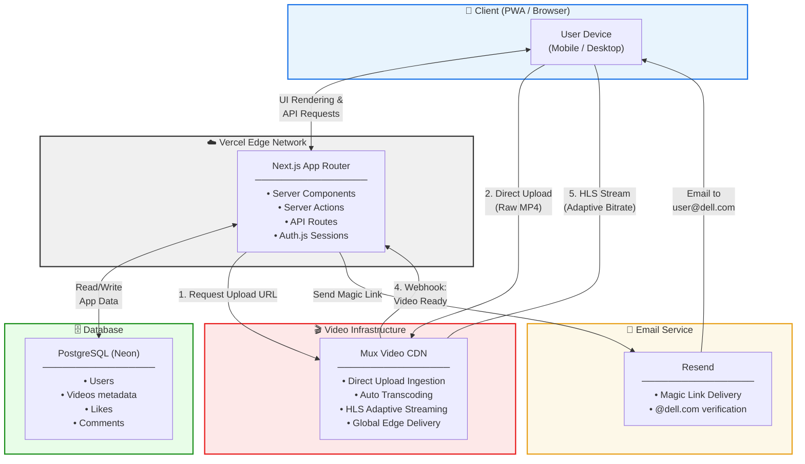
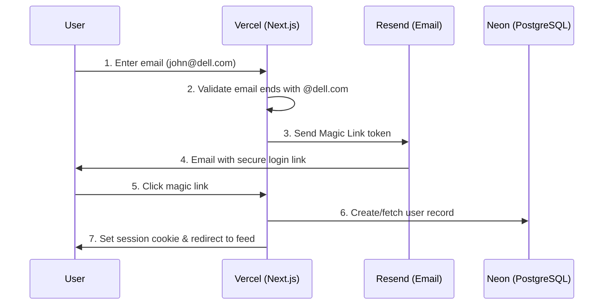
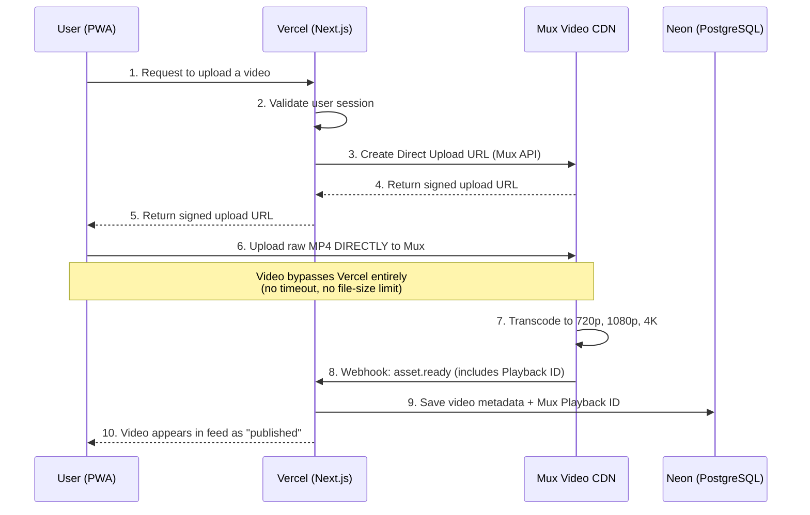
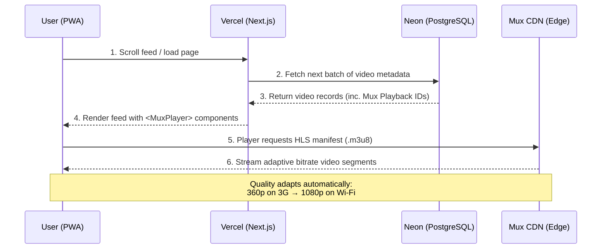
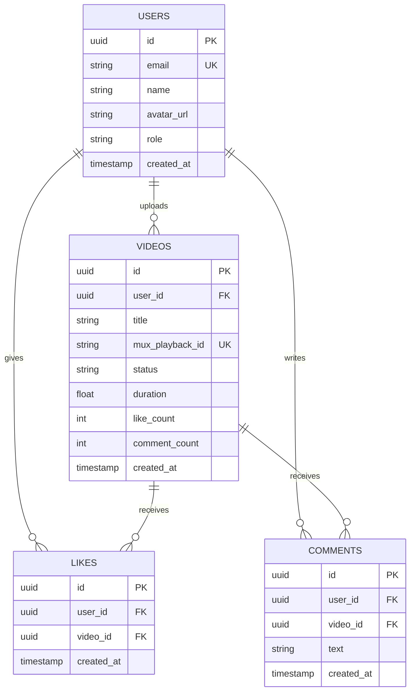
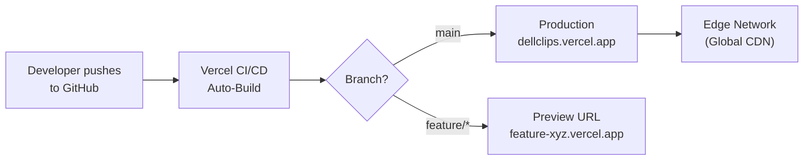

# Technical Architecture Document
## Dell Internal Short-Form Video Platform ("DellClips")

---

### 1. Architecture Overview

The application follows a **modern serverless architecture** optimized for
video-heavy workloads. The key design principle is **separation of concerns**:

- **Vercel (Next.js)** handles the UI, authentication, and API orchestration.
- **Mux** handles all video-related heavy lifting (upload, transcode, stream).
- **Neon PostgreSQL** stores all application state and relational data.

This separation ensures that large video files never touch our application
servers, eliminating timeout errors, file-size limits, and unnecessary
bandwidth costs.

---

### 2. Technology Stack

| Layer              | Technology                  | Purpose                                                                    |
| :----------------- | :-------------------------- | :------------------------------------------------------------------------- |
| **Framework**      | Next.js 15 (App Router)     | Full-stack React framework for UI + Server Actions + API Routes            |
| **Language**       | TypeScript                  | Type safety across the entire codebase                                     |
| **Styling**        | Tailwind CSS                | Utility-first CSS for rapid, responsive mobile-first UI development        |
| **PWA**            | Serwist (next-pwa successor)| Service worker management, manifest generation, install prompts            |
| **Authentication** | Auth.js (NextAuth) + Resend | Passwordless Magic Link / OTP restricted to `@dell.com` domain            |
| **Database**       | PostgreSQL on Neon          | Serverless Postgres with connection pooling, optimized for Vercel          |
| **ORM**            | Drizzle ORM (or Prisma)     | Type-safe database queries and schema migrations                           |
| **Video Platform** | Mux Video                   | Direct upload, transcoding, HLS adaptive streaming, edge CDN delivery      |
| **Video Player**   | `@mux/mux-player-react`     | Drop-in React component with HLS, adaptive bitrate, and accessibility      |
| **Hosting**        | Vercel                      | Zero-config Next.js deployment, edge network, auto-scaling, preview URLs   |
| **Email Service**  | Resend                      | Transactional email delivery for authentication magic links                |

---

### 3. System Architecture Diagram



> **Rendering Note:** This diagram uses
> [Mermaid](https://mermaid.js.org/) syntax. It renders natively in GitHub,
> GitLab, Confluence, Notion, and VS Code (with the Mermaid extension).
> If your viewer does not support Mermaid, paste the code block into
> [mermaid.live](https://mermaid.live) to see the rendered diagram.

---

### 4. Core Workflows

#### 4.1 Authentication Flow



**Key Security Measures:**
- Email domain validation: only `@dell.com` addresses accepted
- Magic link tokens expire after 10 minutes
- Sessions stored in secure, HttpOnly, SameSite cookies
- CSRF protection built into Auth.js

#### 4.2 Video Upload Flow



**Why Direct Upload?**
- Vercel serverless functions have a **4.5 MB body size limit** and a
  **60-second execution timeout**
- A 30-second 1080p video can easily be 50–150 MB
- Direct-to-Mux upload eliminates this bottleneck entirely

#### 4.3 Video Playback Flow



---

### 5. Database Schema

```sql
-- Users table
CREATE TABLE users (
    id            UUID PRIMARY KEY DEFAULT gen_random_uuid(),
    email         VARCHAR(255) UNIQUE NOT NULL,
    name          VARCHAR(255),
    avatar_url    TEXT,
    role          VARCHAR(20) DEFAULT 'user',
    created_at    TIMESTAMP DEFAULT NOW(),
    updated_at    TIMESTAMP DEFAULT NOW()
);

-- Videos table
CREATE TABLE videos (
    id              UUID PRIMARY KEY DEFAULT gen_random_uuid(),
    user_id         UUID NOT NULL REFERENCES users(id) ON DELETE CASCADE,
    title           VARCHAR(500),
    description     TEXT,
    mux_asset_id    VARCHAR(255) UNIQUE NOT NULL,
    mux_playback_id VARCHAR(255) UNIQUE NOT NULL,
    mux_upload_id   VARCHAR(255),
    status          VARCHAR(20) DEFAULT 'processing',
    duration        FLOAT,
    like_count      INTEGER DEFAULT 0,
    comment_count   INTEGER DEFAULT 0,
    created_at      TIMESTAMP DEFAULT NOW()
);

-- Likes table
CREATE TABLE likes (
    id          UUID PRIMARY KEY DEFAULT gen_random_uuid(),
    user_id     UUID NOT NULL REFERENCES users(id) ON DELETE CASCADE,
    video_id    UUID NOT NULL REFERENCES videos(id) ON DELETE CASCADE,
    created_at  TIMESTAMP DEFAULT NOW(),
    UNIQUE(user_id, video_id)
);

-- Comments table
CREATE TABLE comments (
    id          UUID PRIMARY KEY DEFAULT gen_random_uuid(),
    user_id     UUID NOT NULL REFERENCES users(id) ON DELETE CASCADE,
    video_id    UUID NOT NULL REFERENCES videos(id) ON DELETE CASCADE,
    text        TEXT NOT NULL,
    created_at  TIMESTAMP DEFAULT NOW()
);

-- Indexes for performance
CREATE INDEX idx_videos_user_id ON videos(user_id);
CREATE INDEX idx_videos_status ON videos(status);
CREATE INDEX idx_videos_created_at ON videos(created_at DESC);
CREATE INDEX idx_likes_video_id ON likes(video_id);
CREATE INDEX idx_comments_video_id ON comments(video_id);
CREATE INDEX idx_comments_created_at ON comments(created_at DESC);
```

**Entity Relationship Overview:**



---

### 6. Project Structure (Next.js App Router)

```
dellclips/
├── app/
│   ├── layout.tsx
│   ├── manifest.ts
│   ├── page.tsx
│   ├── (auth)/
│   │   ├── login/page.tsx
│   │   └── verify/page.tsx
│   ├── (app)/
│   │   ├── layout.tsx
│   │   ├── feed/page.tsx
│   │   ├── upload/page.tsx
│   │   └── profile/[id]/page.tsx
│   └── api/
│       ├── auth/[...nextauth]/
│       ├── mux/
│       │   ├── upload-url/route.ts
│       │   └── webhook/route.ts
│       └── videos/
│           ├── route.ts
│           └── [id]/
│               ├── like/route.ts
│               └── comments/route.ts
├── components/
│   ├── video-player.tsx
│   ├── video-card.tsx
│   ├── video-feed.tsx
│   ├── upload-form.tsx
│   ├── comment-section.tsx
│   └── nav-bar.tsx
├── lib/
│   ├── auth.ts
│   ├── db.ts
│   ├── mux.ts
│   └── utils.ts
├── public/
│   ├── icons/
│   └── sw.js
├── drizzle/
│   └── schema.ts
├── tailwind.config.ts
├── next.config.ts
├── package.json
└── tsconfig.json
```

---

### 7. Key Design Decisions

| Decision                                | Rationale                                                                                                  |
| :-------------------------------------- | :--------------------------------------------------------------------------------------------------------- |
| **PWA over Native Apps**                | Eliminates App Store / Play Store approval process; single codebase for all platforms and devices.          |
| **Mux over Google Drive / S3 / GitHub** | Google Drive has no streaming capability. S3 serves raw files with no transcoding. GitHub has a 100MB file limit. Mux provides automatic transcoding, adaptive bitrate HLS streaming, and a global edge CDN. |
| **Direct-to-Mux Upload**               | Avoids Vercel's 4.5 MB serverless function body limit and 60s timeout. Videos go straight from browser to Mux. |
| **Magic Links over Enterprise SSO**     | 10x faster to implement for MVP. SSO (Okta/Entra) can be added in V2 via Auth.js's provider system.       |
| **PostgreSQL over NoSQL**               | Clean relational model for Users, Videos, Likes, Comments. Neon's serverless pooling is Vercel-optimized.  |
| **Drizzle ORM over raw SQL**            | Type-safe queries that catch schema errors at compile time, with excellent migration tooling.               |
| **Tailwind CSS over component library** | Maximum flexibility for the custom TikTok-style full-screen vertical layout. No fighting against pre-built component constraints. |

---

### 8. Infrastructure & Cost Estimates (MVP Scale)

| Service         | Free Tier                           | Estimated MVP Cost (post-free)   |
| :-------------- | :---------------------------------- | :------------------------------- |
| **Vercel**      | 100 GB bandwidth, 100 hrs compute  | $20/mo (Pro plan)                |
| **Neon**        | 0.5 GB storage, 190 hrs compute    | $0-19/mo                        |
| **Mux**         | No free tier; pay-as-you-go        | ~$50-100/mo for 500 videos       |
| **Resend**      | 3,000 emails/mo free               | $0 for MVP scale                 |
| **Domain**      | N/A                                | ~$12/year                        |
| **Total (MVP)** |                                     | **~$70-140/month**               |

---

### 9. Deployment & CI/CD



- Every push to `main` triggers an automatic production deployment
- Every pull request gets a unique **Preview URL** for testing and review
- Zero-downtime deployments with instant rollback capability
- Environment variables (Mux API keys, DB connection strings) managed
  securely in Vercel's dashboard

---

### 10. Security Considerations

| Concern                    | Mitigation                                                                  |
| :------------------------- | :-------------------------------------------------------------------------- |
| **Unauthorized Access**    | Email domain validation (`@dell.com` only) at authentication layer          |
| **Session Hijacking**      | HttpOnly, Secure, SameSite=Strict cookies; short-lived JWT tokens           |
| **Video Access Control**   | Mux Signed Playback URLs (V2) to prevent unauthorized video sharing         |
| **CSRF Attacks**           | Built-in CSRF protection via Auth.js                                        |
| **Webhook Spoofing**       | Mux webhook signature verification on all incoming webhook requests         |
| **SQL Injection**          | Parameterized queries via Drizzle ORM; no raw string concatenation          |
| **File Upload Abuse**      | File type validation (video/mp4, video/webm only); 200 MB size cap          |
| **Rate Limiting**          | Vercel Edge Middleware rate limiting on auth and upload endpoints            |

---

### 11. MVP Timeline Estimate

| Week   | Milestone                                                        |
| :----- | :--------------------------------------------------------------- |
| Week 1 | Project setup, Auth.js + Magic Links, PWA configuration, DB schema |
| Week 2 | Mux integration (upload + webhook + playback), Video feed UI     |
| Week 3 | Likes, Comments, User Profiles, Responsive polish                |
| Week 4 | Testing, bug fixes, security review, internal soft launch        |

**Total estimated MVP delivery: 4 weeks** with 1-2 engineers.

---

### 12. Future Architecture Considerations (V2+)

- **Enterprise SSO:** Add Okta/Microsoft Entra provider to Auth.js
  configuration (minimal code change).
- **Real-Time Features:** Add WebSocket support (via Vercel's ai SDK or
  Pusher) for live comment updates.
- **Content Moderation:** Integrate AI-based content moderation (e.g., Mux's
  built-in moderation or a custom model) before publishing.
- **Analytics:** Mux Data provides built-in video quality analytics (buffering
  rate, startup time, engagement).
- **Multi-Region:** Neon supports read replicas for global latency
  optimization if Dell scales this internationally.