# High-Level Design (HLD) Document
## Dell Internal Short-Form Video Platform ("DellClips")
### Version 1.0

---

## Table of Contents

1. [Executive Summary](#1-executive-summary)
2. [Goals & Constraints](#2-goals--constraints)
3. [System Context](#3-system-context)
4. [High-Level Architecture](#4-high-level-architecture)
5. [Component Descriptions](#5-component-descriptions)
6. [Data Flow Diagrams](#6-data-flow-diagrams)
7. [Data Architecture](#7-data-architecture)
8. [Video Storage & Delivery Model](#8-video-storage--delivery-model)
9. [Authentication & Authorization Model](#9-authentication--authorization-model)
10. [Integration Points & Contracts](#10-integration-points--contracts)
11. [Deployment Architecture](#11-deployment-architecture)
12. [Scalability Model](#12-scalability-model)
13. [Reliability & Failure Modes](#13-reliability--failure-modes)
14. [Security Architecture](#14-security-architecture)
15. [Replaceability & Vendor Independence](#15-replaceability--vendor-independence)
16. [Cost Model](#16-cost-model)
17. [Risks & Mitigations](#17-risks--mitigations)
18. [Future Evolution](#18-future-evolution)
19. [Decision Log](#19-decision-log)
20. [Glossary](#20-glossary)

---

## 1. Executive Summary

DellClips is an internal, mobile-first short-form video platform exclusively
for Dell Technologies employees. It enables employees to share knowledge,
celebrate achievements, and communicate across departments through engaging
short-form vertical video content — similar in experience to TikTok or
Instagram Reels.

**Key characteristics:**
- **Progressive Web App (PWA)** — installable on any phone or desktop
  without App Store deployment
- **Dell-only access** — restricted to verified `@dell.com` email addresses
- **Near-zero infrastructure cost** — MVP runs on ~$5-10/month using
  free-tier services
- **Vendor-independent architecture** — every external component can be
  replaced without application rewrites
- **AI-assisted development** — estimated 2-week delivery with 1 engineer

---

## 2. Goals & Constraints

### 2.1 Business Goals

| # | Goal                                                                    |
|:--|:------------------------------------------------------------------------|
| G1 | Increase internal engagement and cross-department visibility           |
| G2 | Provide a modern, mobile-first communication channel for Dell employees|
| G3 | Validate the concept quickly with minimal investment (MVP-first)       |
| G4 | Enable non-technical employees to create and share content easily      |

### 2.2 Technical Goals

| # | Goal                                                                    |
|:--|:------------------------------------------------------------------------|
| T1 | Deliver TikTok-grade video playback (adaptive bitrate, <2s start)     |
| T2 | Support mobile and desktop from a single codebase                      |
| T3 | Ensure every external dependency is replaceable via interface contracts|
| T4 | Minimize operational burden — no servers to manage                     |
| T5 | Keep MVP cost under $15/month                                          |

### 2.3 Constraints

| # | Constraint                                                              |
|:--|:------------------------------------------------------------------------|
| C1 | No native app deployment (avoid App Store / Play Store processes)      |
| C2 | Authentication must verify Dell employment without enterprise SSO initially |
| C3 | Video files must never pass through the application server             |
| C4 | System must comply with Dell's data handling and security policies     |
| C5 | MVP must be deliverable within 2 weeks                                 |

---

## 3. System Context

This diagram shows DellClips in the context of its surrounding systems
and actors.

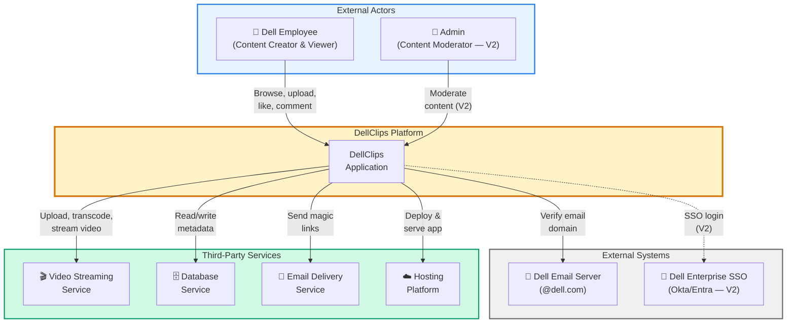

---

## 4. High-Level Architecture

### 4.1 Architecture Pattern

The system uses a **Hexagonal Architecture (Ports & Adapters)** pattern.
All business logic resides in a vendor-agnostic core. External systems
are accessed exclusively through abstract interface contracts (Ports),
with vendor-specific implementations (Adapters) that can be swapped
independently.

### 4.2 System Architecture Overview

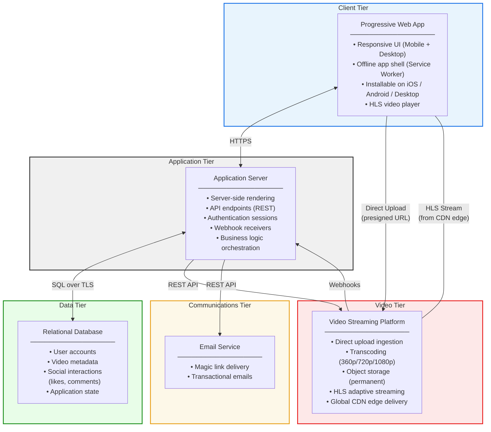

### 4.3 Architecture Tiers Summary

| Tier | Responsibility | Current Implementation | Replaceable? |
|:-----|:---------------|:-----------------------|:-------------|
| **Client** | UI rendering, PWA shell, video playback | Next.js (React) + hls.js | ✅ Yes (any frontend framework) |
| **Application** | Business logic, API, auth, webhook handling | Next.js App Router on Vercel | ✅ Yes (any Node.js host) |
| **Data** | Persistent storage of users, metadata, interactions | PostgreSQL on Neon | ✅ Yes (any PostgreSQL host) |
| **Video** | Video ingestion, transcoding, storage, CDN delivery | Cloudflare Stream | ✅ Yes (Mux, Bunny, self-hosted) |
| **Communications** | Email delivery for authentication | Resend | ✅ Yes (SendGrid, AWS SES, etc.) |

---

## 5. Component Descriptions

### 5.1 Client Tier — Progressive Web App

| Aspect | Detail |
|:-------|:-------|
| **Type** | Single Page Application with Server-Side Rendering |
| **Install Method** | "Add to Home Screen" browser prompt (no App Store) |
| **Offline Support** | App shell cached via Service Worker; video requires connectivity |
| **Video Playback** | HLS.js player renders adaptive bitrate streams from CDN |
| **Upload** | Client uploads directly to Video Tier via presigned URL (bypasses Application Tier) |
| **Platforms** | iOS Safari, Android Chrome, Desktop Chrome/Edge/Firefox |

### 5.2 Application Tier — API & Business Logic

| Aspect | Detail |
|:-------|:-------|
| **Runtime** | Serverless functions (no long-running servers) |
| **Responsibilities** | Authentication, authorization, CRUD operations on metadata, webhook processing, feed generation |
| **Scaling** | Auto-scales from 0 to thousands of concurrent invocations |
| **Key Constraint** | 4.5 MB request body limit and 60s timeout — this is why video uploads bypass this tier |

### 5.3 Data Tier — Relational Database

| Aspect | Detail |
|:-------|:-------|
| **Engine** | PostgreSQL 16 |
| **Hosting** | Serverless managed (scales to zero when idle) |
| **Data Stored** | Users, video metadata, likes, comments (~0.5 KB per video record) |
| **Data NOT Stored** | Video files (stored in Video Tier) |
| **Connection Model** | Built-in connection pooling to handle serverless burst patterns |
| **Backup Model** | Automated Point-in-Time Recovery (PITR) |

### 5.4 Video Tier — Streaming Platform

| Aspect | Detail |
|:-------|:-------|
| **Ingestion** | Direct upload from client via presigned URL |
| **Processing** | Automatic transcoding to 360p, 720p, 1080p HLS segments |
| **Storage** | Permanent object storage (S3-compatible) managed by provider |
| **Delivery** | Global CDN with 300+ edge nodes; adaptive bitrate streaming |
| **Data Returned to App** | A `playback_id` string (stored in Data Tier) |

### 5.5 Communications Tier — Email Service

| Aspect | Detail |
|:-------|:-------|
| **Purpose** | Deliver authentication magic links to `@dell.com` emails |
| **Volume** | Low (1 email per login session) |
| **Free Tier** | 3,000 emails/month — sufficient for MVP scale |

---

## 6. Data Flow Diagrams

### 6.1 User Authentication Flow

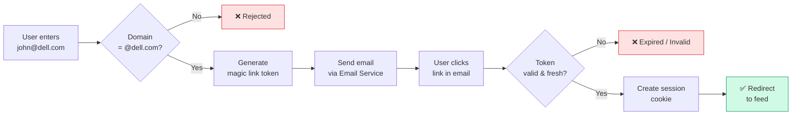

### 6.2 Video Upload Flow

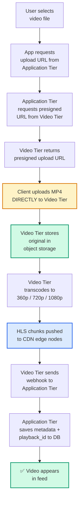

**Critical Design Decision:** The video file travels from the user's
device directly to the Video Tier. It never passes through the
Application Tier. This avoids serverless function size limits and
timeout constraints.

### 6.3 Video Playback Flow

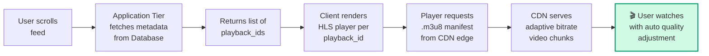

**Key Behavior:** The CDN automatically selects the best quality
(360p/720p/1080p) based on the viewer's network speed. Quality can
change mid-stream without interruption.

### 6.4 Social Interaction Flow (Likes & Comments)

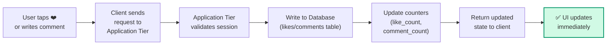
### 6.5 Report Video Flow

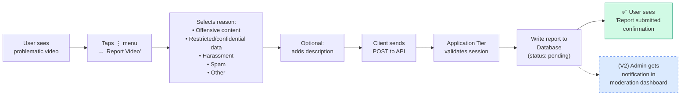

**Why user-driven reporting?**
- Video files cannot be automatically scanned for offensive content or
  restricted data at the application layer without specialized (and
  expensive) AI moderation services
- User reporting provides an immediate, zero-cost moderation mechanism
- Every report is tied to a verified `@dell.com` identity, creating
  accountability
- Reports are stored with status tracking (pending → reviewed →
  actioned) for the V2 moderation dashboard

**Report Reasons (predefined):**
| Reason Code | Display Text |
|:------------|:-------------|
| `offensive` | Offensive or inappropriate content |
| `restricted_data` | Contains restricted or confidential Dell data |
| `harassment` | Harassment or bullying |
| `spam` | Spam or misleading content |
| `other` | Other (with free-text description) |

### 6.6 Follow / Subscribe Flow

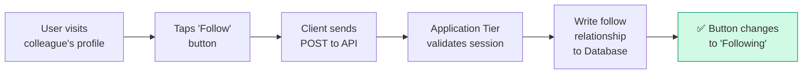

**Feed personalization logic:**
- When a user opens the feed, the query prioritizes videos from
  followed users
- Videos from non-followed users are still shown (to enable discovery)
  but ranked lower
- Feed algorithm (simplified): `followed users' recent videos first`
  → `trending videos` → `chronological backfill`

### 6.7 Search & Hashtag Flow

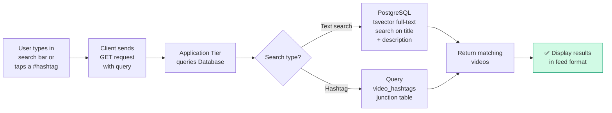

**Search implementation notes:**
- Full-text search uses PostgreSQL's built-in `tsvector` / `tsquery`
  — no external search engine (like Elasticsearch) is needed for
  MVP scale
- Hashtags are normalized (lowercase, no spaces) and stored in a
  dedicated table with a many-to-many junction to videos
- The search bar supports both free text and hashtag prefix (#)
---

## 7. Data Architecture

### 7.1 Data Classification

### 7.1 Data Classification

| Data Type | Where Stored | Approx. Size Per Record | Volume (MVP) |
|:----------|:-------------|:------------------------|:-------------|
| User accounts | Database (Data Tier) | ~0.3 KB | ~100-500 users |
| Video metadata | Database (Data Tier) | ~0.5 KB | ~50-200 videos |
| Likes | Database (Data Tier) | ~0.1 KB | ~1,000-5,000 |
| Comments | Database (Data Tier) | ~0.2 KB | ~500-2,000 |
| **Reports** | **Database (Data Tier)** | **~0.3 KB** | **~50-200** |
| **Follows** | **Database (Data Tier)** | **~0.1 KB** | **~500-2,000** |
| **Hashtags** | **Database (Data Tier)** | **~0.1 KB** | **~100-500** |
| **Video-Hashtag links** | **Database (Data Tier)** | **~0.1 KB** | **~200-1,000** |
| Video files (MP4/HLS) | Object Storage (Video Tier) | ~50-150 MB | ~50-200 videos |
| User avatars | Blob Storage | ~0.1-1 MB | ~100-500 |

**Key Insight:** The Database stores only ~1 KB per video. The actual
video file (~100 MB) lives in the Video Tier's object storage. Your
database will hold less than 1 MB of data even with hundreds of videos.

### 7.2 Entity Relationship Model

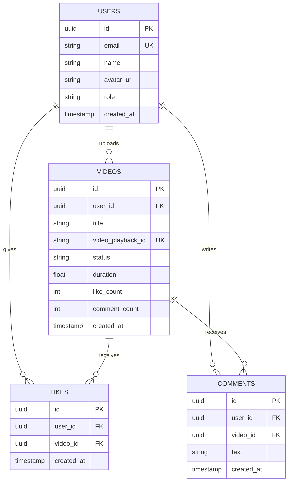

### 7.3 Data Retention & Lifecycle

| Data | Retention Policy | Deletion Behavior |
|:-----|:-----------------|:------------------|
| User accounts | Retained while employee is active | Soft-delete; anonymize after offboarding |
| Video metadata | Retained indefinitely | Hard-delete cascades to likes and comments |
| Video files | Retained indefinitely | Deleted from Video Tier via API when metadata is deleted |
| Likes & Comments | Tied to video lifecycle | Cascade-deleted when parent video is removed |

---

## 8. Video Storage & Delivery Model

This section provides a detailed view of how video files flow through
the system, where they physically reside, and how they are delivered
to viewers.

### 8.1 Video Lifecycle

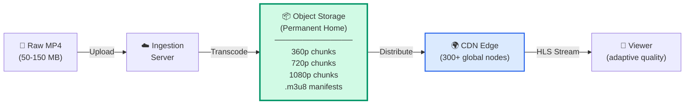

### 8.2 Storage Layers

| Layer | Contents | Location | Managed By | Accessed By App? |
|:------|:---------|:---------|:-----------|:-----------------|
| **Ingestion** | Raw uploaded MP4 | Provider's upload servers | Video Tier provider | ❌ No |
| **Object Storage** | Transcoded HLS chunks + manifests | Provider's S3-compatible storage | Video Tier provider | ❌ No |
| **CDN Edge Cache** | Cached copies of popular chunks | 300+ global edge nodes | Video Tier provider | ❌ No |
| **Application DB** | `playback_id` string + metadata | PostgreSQL (Data Tier) | Application team | ✅ Yes |

### 8.3 What the Application Stores vs. What It Does Not

```
┌─────────────────────────────────────────────────────────┐
│ YOUR DATABASE stores per video:                         │
│                                                         │
│   video_playback_id: "a1b2c3d4e5f6"    (~30 bytes)     │
│   title: "Q4 Sales Kickoff"            (~20 bytes)     │
│   user_id: "uuid-here"                 (~36 bytes)     │
│   status: "ready"                      (~5 bytes)      │
│   duration: 28.5                       (~8 bytes)      │
│                                                         │
│   TOTAL: ~0.5 KB per video                              │
├─────────────────────────────────────────────────────────┤
│ THE VIDEO TIER stores per video:                        │
│                                                         │
│   Original MP4:           ~80 MB                        │
│   360p HLS chunks:        ~15 MB                        │
│   720p HLS chunks:        ~40 MB                        │
│   1080p HLS chunks:       ~80 MB                        │
│   HLS manifests:          ~2 KB                         │
│                                                         │
│   TOTAL: ~215 MB per video                              │
└─────────────────────────────────────────────────────────┘

Your database handles 0.0002% of the total data per video.
```

---

## 9. Authentication & Authorization Model

### 9.1 Authentication Strategy (MVP)

| Aspect | Detail |
|:-------|:-------|
| **Method** | Passwordless Magic Link (email-based OTP) |
| **Identity Verification** | Email domain must be `@dell.com` |
| **Session Management** | Secure HttpOnly cookie with short-lived JWT |
| **Token Expiry** | Magic link valid for 10 minutes |
| **Multi-Device** | Each device maintains its own session |

### 9.2 Authentication Flow

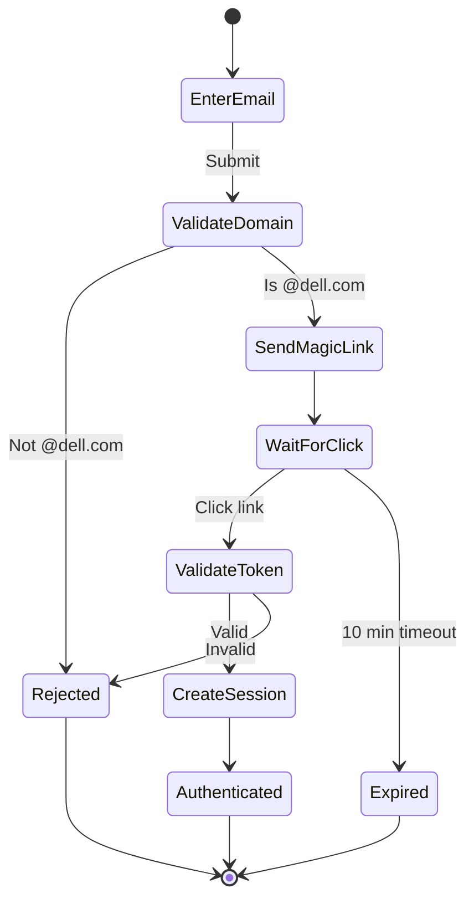

### 9.3 Authorization Model (MVP)

| Role | Permissions |
|:-----|:------------|
| **User** (default) | View feed, upload videos, like, comment, manage own profile, delete own videos |
| **Admin** (V2) | All user permissions + delete any video, ban users, access moderation dashboard |

### 9.4 Future SSO Migration Path

When Dell IT requires enterprise SSO:
1. Implement a new `AuthPort` adapter for Okta or Microsoft Entra ID
2. Configure SAML or OIDC protocol
3. Update the composition root to use the new adapter
4. Magic link flow remains as a fallback for edge cases
5. **Zero changes** to any other system component

---

## 10. Integration Points & Contracts

Every external integration follows the Ports & Adapters pattern. This
table documents each integration point, its contract, and failure behavior.

| Integration | Direction | Protocol | Contract | Failure Behavior |
|:------------|:----------|:---------|:---------|:-----------------|
| **App ↔ Database** | Bidirectional | SQL over TLS | `DatabasePort` interface (CRUD operations on users, videos, likes, comments) | Retry with exponential backoff; show error state in UI |
| **App → Video Tier** (upload URL request) | Outbound | REST API (HTTPS) | `VideoPort.createUploadUrl()` → returns `{ uploadUrl, assetId }` | Show upload error; user retries manually |
| **Client → Video Tier** (direct upload) | Outbound | HTTPS PUT to presigned URL | Raw MP4 binary; max 200 MB, max 60 seconds | Client-side retry with progress indicator |
| **Video Tier → App** (webhook) | Inbound | HTTPS POST (webhook) | JSON payload containing asset status + `playback_id` | Idempotent handler; Video Tier retries automatically |
| **Client ← Video Tier** (playback) | Inbound | HLS over HTTPS | `.m3u8` manifest + `.ts` video chunks | Player degrades quality automatically; shows buffering indicator |
| **App → Email Service** | Outbound | REST API (HTTPS) | `EmailPort.sendMagicLink(email, token)` | Retry once; show "resend" button to user |
| **Email Service → User** | Outbound | SMTP to Dell mail servers | Standard email with HTML body containing magic link | User clicks "resend"; email service retry queue handles delivery |

---

## 11. Deployment Architecture

### 11.1 Environment Strategy

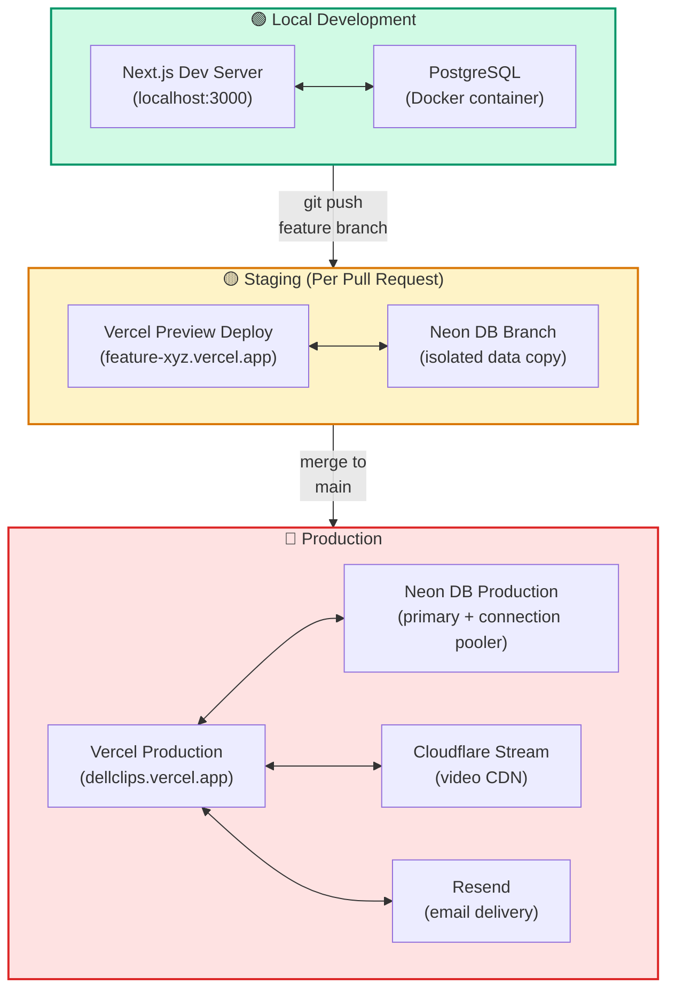

### 11.2 CI/CD Pipeline

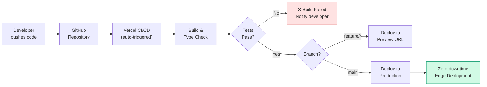

### 11.3 Environment Configuration

| Environment | App URL | Database | Video Tier | Email |
|:------------|:--------|:---------|:-----------|:------|
| **Local** | localhost:3000 | Docker PostgreSQL | Cloudflare Stream (dev mode) | Console log (no actual send) |
| **Staging** | feature-xyz.vercel.app | Neon Branch (free) | Cloudflare Stream (shared) | Resend (free tier) |
| **Production** | dellclips.vercel.app | Neon Production | Cloudflare Stream | Resend |

---

## 12. Scalability Model

### 12.1 Scaling Strategy Per Tier

| Tier | Scaling Mechanism | Scaling Trigger | Limit |
|:-----|:------------------|:----------------|:------|
| **Client (PWA)** | Static assets cached at CDN edge | N/A — already distributed | Unlimited |
| **Application** | Serverless auto-scaling (0 → N instances) | Incoming request volume | Vercel: 1,000 concurrent functions (free tier) |
| **Database** | Serverless compute auto-scaling + read replicas (V2) | Query volume / connection count | Neon free tier: 190 compute hours/mo |
| **Video (Storage)** | Unlimited object storage | N/A — pay per GB | No hard limit |
| **Video (Delivery)** | Global CDN auto-scales at edge | Viewer request volume | No hard limit |

### 12.2 Bottleneck Analysis

| Potential Bottleneck | Trigger Point | Mitigation |
|:---------------------|:--------------|:-----------|
| Database connections | >100 concurrent serverless functions | Connection pooling (built into Neon) |
| Database compute hours | Heavy read load on feed | Add read replica; implement cursor-based pagination |
| Vercel function timeout | Long-running operations | All heavy work (transcoding) offloaded to Video Tier |
| Email rate limit | >100 logins/day on free tier | Upgrade Resend plan ($20/mo for 50,000 emails) |

### 12.3 Projected Scale Stages

| Stage | Users | Videos | Monthly Views | Infra Changes Needed |
|:------|:------|:-------|:--------------|:---------------------|
| **Pilot** | 50-100 | 50 | 500 | None (free tiers sufficient) |
| **Department** | 500 | 500 | 5,000 | None (still within limits) |
| **Company-wide** | 5,000+ | 5,000+ | 50,000+ | Upgrade Neon + Vercel to paid tiers; add DB read replica |

---

## 13. Reliability & Failure Modes

| Failure Scenario | Impact | Detection | Recovery |
|:-----------------|:-------|:----------|:---------|
| **Vercel outage** | App inaccessible | Vercel status page; uptime monitor | Automatic (Vercel's multi-region failover); or redeploy to Netlify |
| **Database unavailable** | Feed won't load; no new likes/comments | Health check endpoint; Neon status page | Automatic failover (Neon managed); or restore from PITR |
| **Video Tier outage** | Existing videos won't play; uploads fail | Webhook delivery failures; CDN health check | Videos resume when service recovers; uploads can be retried |
| **Email service down** | Users can't log in | Magic link delivery failure alerts | Show "resend" button; swap to backup email adapter |
| **Webhook delivery failure** | Uploaded video stuck in "processing" status | Monitor for videos in "processing" > 10 minutes | Video Tier retries webhooks; manual reconciliation via API |
| **CDN cache miss** | Slightly slower first-play for unpopular videos | Player metrics (time-to-first-byte) | CDN fetches from origin storage automatically |

### 13.1 Availability Targets

| Tier | Target | Basis |
|:-----|:-------|:------|
| Application (Vercel) | 99.99% | Vercel SLA |
| Database (Neon) | 99.95% | Neon SLA |
| Video CDN (Cloudflare) | 99.99% | Cloudflare SLA |
| **Composite System** | **~99.9%** | Weakest link (database) |

---

## 14. Security Architecture

### 14.1 Security Model Diagram

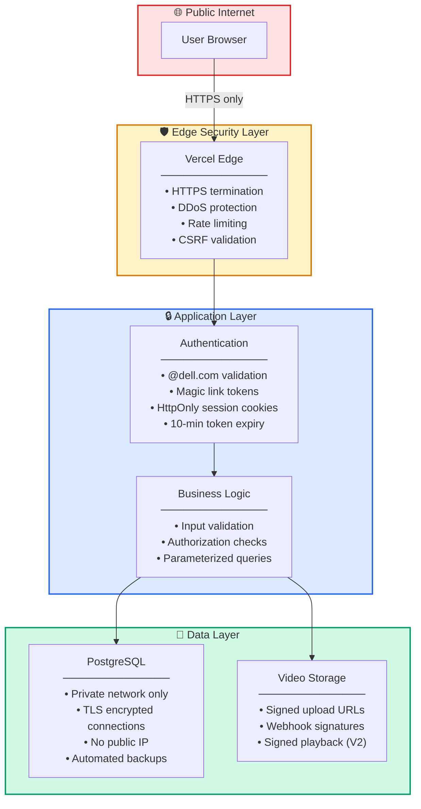

### 14.2 Security Controls

| Layer | Control | Implementation |
|:------|:--------|:---------------|
| **Transport** | All traffic encrypted via TLS/HTTPS | Vercel automatic SSL certificates |
| **Edge** | DDoS protection and rate limiting | Vercel Edge Middleware |
| **Authentication** | Domain-restricted passwordless login | Auth.js with `@dell.com` email validation |
| **Session** | Tamper-proof session tokens | HttpOnly, Secure, SameSite=Strict cookies |
| **CSRF** | Cross-site request forgery prevention | Built into Auth.js |
| **Injection** | SQL injection prevention | Parameterized queries via ORM (Drizzle) |
| **Upload** | File type and size validation | Server-side MIME type check; 200 MB / 60 sec limits |
| **Webhooks** | Webhook authenticity verification | Cryptographic signature validation on all inbound webhooks |
| **Database** | Network isolation | Private VPC; no public IP; TLS-only connections |
| **Video Access** | Prevent unauthorized sharing (V2) | Signed playback URLs with expiry tokens |

---

## 15. Replaceability & Vendor Independence

A core architectural principle of DellClips is that **no single vendor
creates lock-in**. Every external dependency is accessed through an
abstract interface (Port) with a swappable implementation (Adapter).

### 15.1 Replacement Matrix

| Component | Current Vendor | Replacement Options | What Changes | What Does NOT Change |
|:----------|:---------------|:--------------------|:-------------|:---------------------|
| **Auth** | Auth.js (Magic Links) | Okta, Microsoft Entra, Keycloak, Clerk | 1 adapter file + 1 line in composition root | All UI, API routes, DB, video logic |
| **Database** | Neon (PostgreSQL) | Supabase, AWS RDS, Azure DB, self-hosted PG | Connection string + adapter config | All business logic, schema, API routes |
| **Video** | Cloudflare Stream | Mux, Bunny Stream, AWS MediaConvert + CloudFront | 1 adapter file + webhook parser + 1 line in composition root | All UI, DB, auth, feed logic |
| **Video Player** | hls.js | Video.js, Mux Player, Plyr, Shaka Player | 1 UI component file | All API routes, DB, auth |
| **Email** | Resend | SendGrid, AWS SES, Mailgun, Postmark | 1 adapter file + 1 line in composition root | All UI, DB, auth, video logic |
| **Hosting** | Vercel | Netlify, Cloudflare Pages, AWS Amplify, self-hosted Node.js | Deployment config | All application code |
| **ORM** | Drizzle | Prisma, Kysely, TypeORM | Database adapter internals | All business logic, API contracts |
| **Full Self-Hosted** | All cloud services | MinIO + FFmpeg + Nginx + Keycloak + self-hosted PG | All adapters | Core business logic (Ports remain stable) |

### 15.2 Composition Root Pattern

The composition root (`lib/services.ts`) is the **single file** where all
vendor decisions are made. Swapping any vendor means changing an import
and instantiation in this one file:

```
// To swap from Cloudflare to Mux:
// 1. Write MuxVideoService implementing VideoPort
// 2. Change this one line:
//    export const videoService = new CloudflareVideoService();
//    →
//    export const videoService = new MuxVideoService();
// 3. Done. Zero other changes.
```

---

## 16. Cost Model

### 16.1 MVP Cost Breakdown

| Component | Service | Free Tier | MVP Monthly Cost |
|:----------|:--------|:----------|:-----------------|
| Hosting | Vercel | ✅ 100 GB bandwidth | **$0** |
| Database | Neon PostgreSQL | ✅ 0.5 GB, 190 compute hrs | **$0** |
| Auth Library | Auth.js | ✅ Open source | **$0** |
| Auth Emails | Resend | ✅ 3,000 emails/mo | **$0** |
| PWA Framework | Serwist | ✅ Open source | **$0** |
| ORM | Drizzle | ✅ Open source | **$0** |
| Video Player | hls.js | ✅ Open source | **$0** |
| Video Platform | Cloudflare Stream | ❌ Pay-as-you-go | **~$5-10** |
| Domain | Vercel subdomain | ✅ Free (*.vercel.app) | **$0** |
| **TOTAL** | | | **~$5-10/month** |

### 16.2 Cost Scaling Projection

| Scale | Users | Videos | Monthly Views | Est. Cost |
|:------|:------|:-------|:--------------|:----------|
| **Pilot MVP** | 50-100 | 50 | 500 | ~$6-10/mo |
| **Departmental** | 500 | 500 | 5,000 | ~$15-30/mo |
| **Company-wide** | 5,000+ | 5,000+ | 50,000+ | ~$80-200/mo |

### 16.3 Cost vs. Traditional Approach

| Approach | Monthly Cost | Engineering Time |
|:---------|:-------------|:-----------------|
| **DellClips (this design)** | $5-10/mo | ~2 weeks (AI-assisted) |
| **Native iOS + Android apps** | $50-200/mo (+ $99/yr Apple + $25 Google dev accounts) | 3-6 months |
| **Off-the-shelf enterprise video platform** | $500-5,000/mo (licensing) | 1-2 months (configuration) |

---

## 17. Risks & Mitigations

| # | Risk | Likelihood | Impact | Mitigation |
|:--|:-----|:-----------|:-------|:-----------|
| R1 | Dell IT rejects third-party cloud services | Medium | High | Hexagonal Architecture allows migration to self-hosted infrastructure via new adapters (MinIO, FFmpeg, Keycloak) |
| R2 | Free tiers are insufficient at scale | Low (MVP) | Medium | Scaling projections show paid tiers remain very affordable (<$200/mo even at company-wide scale) |
| R3 | Inappropriate content uploaded | Medium | High | V2 includes moderation dashboard; MVP relies on the inherent accountability of `@dell.com` identity |
| R4 | PWA experience is inferior on iOS | Medium | Medium | iOS PWA support has improved significantly; test on real devices during development |
| R5 | Magic link emails go to spam | Low | Medium | Use Resend's verified sending domain; add SPF/DKIM records; provide "resend" button |
| R6 | Video Tier provider changes pricing | Low | Medium | VideoPort interface allows migration to any alternative provider within days |
| R7 | Low adoption / employees don't engage | Medium | High | Seed initial content with leadership videos; gamify with "most watched" leaderboards (V2) |
| R8 | Data privacy / GDPR concerns | Medium | High | All data stays with enterprise-grade providers; add data export and deletion capabilities |

---

## 18. Future Evolution

| Phase | Timeframe | Additions |
|:------|:----------|:----------|
| **V1 (MVP)** | Weeks 1-2 | Core feed, upload, auth, likes, comments, PWA |
| **V1.5** | Weeks 3-4 | Content moderation dashboard, analytics, hashtags |
| **V2** | Month 2-3 | Enterprise SSO, push notifications, AI captions, follow/subscribe |
| **V3** | Month 4+ | AI-powered feed ranking, department channels, live streaming, integration with Dell internal tools |

### 18.1 Architecture Evolution Path

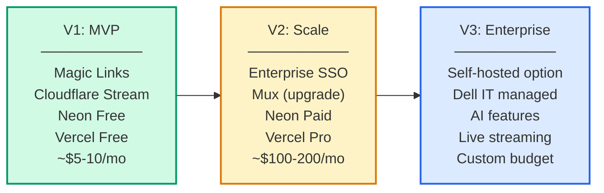

---

## 19. Decision Log

This log records key architectural decisions and their rationale for
future reference.

| # | Decision | Options Considered | Chosen | Rationale |
|:--|:---------|:-------------------|:-------|:----------|
| D1 | App delivery method | Native iOS + Android, PWA, Hybrid (React Native) | **PWA** | Avoids App Store processes; single codebase; installable on all platforms |
| D2 | Authentication (MVP) | Enterprise SSO, Magic Links, Username/Password | **Magic Links** | Fastest to implement; verifies Dell employment via email domain; no passwords to manage |
| D3 | Video infrastructure | YouTube, AWS (S3+MediaConvert+CloudFront), Cloudflare Stream, Mux, Bunny Stream, Self-hosted (MinIO+FFmpeg) | **Cloudflare Stream** | YouTube violates ToS and locks UI. AWS costs ~$85-90/mo and requires 3-4 services. Cloudflare Stream offers same capabilities (transcoding, HLS, CDN) at ~$5-10/mo with a single API. Swappable via VideoPort. |
| D4 | Database | MongoDB, Supabase, PlanetScale, Neon PostgreSQL | **Neon PostgreSQL** | Free tier; serverless; built-in pooling; DB branching; PostgreSQL extensibility (JSONB, pgvector) |
| D5 | Architecture pattern | Monolithic, Microservices, Hexagonal | **Hexagonal** | Maximum replaceability; vendor independence; clean separation of concerns |
| D6 | Video player | Mux Player, Video.js, hls.js, Plyr | **hls.js** | Open-source; vendor-neutral; works with any HLS source |
| D7 | Upload strategy | Through application server, Direct-to-CDN | **Direct-to-CDN** | Avoids serverless size limits and timeouts; better performance |
| D8 | Development approach | Traditional engineering, AI-assisted | **AI-assisted** | ~90% code generation; 2-week delivery vs 4-6 weeks traditional |
| D9 | Video platform cost strategy | Premium vendor (Mux), Budget vendor (Cloudflare/Bunny), Free (YouTube), Enterprise (AWS) | **Budget vendor (Cloudflare Stream)** | MVP must validate concept at minimal cost. YouTube is unusable (ToS, ads, no custom UI). AWS is 8-15x more expensive. Cloudflare provides identical streaming quality at ~$5-10/mo. AWS remains the documented migration path if Dell IT requires it. |

---

## 20. Glossary

| Term | Definition |
|:-----|:-----------|
| **PWA** | Progressive Web App — a website that can be "installed" on a device and behaves like a native app |
| **HLS** | HTTP Live Streaming — an adaptive bitrate streaming protocol that adjusts video quality based on network speed |
| **CDN** | Content Delivery Network — a network of geographically distributed servers that cache and serve content from the nearest location |
| **Transcoding** | The process of converting a video file from one format/resolution to another (e.g., raw MP4 → 360p + 720p + 1080p HLS) |
| **Presigned URL** | A time-limited, pre-authorized URL that allows a client to upload directly to cloud storage without exposing API credentials |
| **Webhook** | An HTTP callback — the Video Tier sends a POST request to our server when a video finishes processing |
| **Magic Link** | A passwordless authentication method where a one-time login link is sent to the user's email |
| **Hexagonal Architecture** | An architecture pattern where business logic is isolated from external systems via abstract interfaces (Ports) and swappable implementations (Adapters) |
| **Composition Root** | The single location in the codebase where all abstract interfaces are bound to their concrete implementations |
| **PITR** | Point-in-Time Recovery — the ability to restore a database to any specific moment in time |
| **ACID** | Atomicity, Consistency, Isolation, Durability — properties that guarantee reliable database transactions |
| **Serverless** | A cloud execution model where the provider manages server infrastructure; compute scales from 0 to N automatically |
| **ORM** | Object-Relational Mapping — a library that maps database tables to programming language objects |


---

## Appendix A: Video Platform Evaluation

This appendix documents the detailed evaluation of video storage and
streaming platforms considered for DellClips.

### A.1 Requirements for Video Infrastructure

The video platform must provide:
1. **Direct upload from client** (bypass application server limits)
2. **Automatic transcoding** to multiple resolutions (360p, 720p, 1080p)
3. **HLS adaptive bitrate streaming** (quality adjusts to network speed)
4. **Global CDN delivery** (low latency worldwide)
5. **Private access control** (prevent unauthorized external access)
6. **API-driven** (no proprietary UI requirements)
7. **Reasonable MVP cost** (under $20/month)

### A.2 Candidates Evaluated

#### A.2.1 YouTube (REJECTED)

**Status: Rejected — not viable for this use case.**

YouTube is a free consumer video-sharing platform. Despite its
excellent infrastructure, it cannot serve as a headless video backend
for a private enterprise application.

**Disqualifying Issues:**

| Issue | Detail |
|:------|:-------|
| **Terms of Service violation** | YouTube ToS Section 5.B explicitly prohibits using the service as a backend for third-party applications. Using YouTube as a headless CDN risks account termination. |
| **No custom player UI** | YouTube requires use of its proprietary iFrame embedded player. This makes it impossible to build a custom TikTok-style vertical scrolling feed with custom controls and overlays. |
| **Ads and competitor recommendations** | YouTube's player displays advertisements and, upon video completion, recommends algorithmically selected content — which may include Dell competitor material. |
| **Inadequate privacy model** | "Unlisted" videos can be shared via URL with anyone. "Private" videos require each viewer to have a Google account that is manually added to an access list — impractical for hundreds of Dell employees. |
| **Content moderation risk** | YouTube's automated content moderation algorithms can flag and remove videos without warning. Internal Dell content (e.g., product demos with music, or screen recordings) could be incorrectly flagged for copyright. |
| **No raw file access** | YouTube does not provide API access to raw video files, HLS manifests, or transcoded chunks. All playback must go through YouTube's player. |

#### A.2.2 AWS — S3 + MediaConvert + CloudFront (DEFERRED)

**Status: Deferred to V2/V3 — viable but unnecessarily complex and
expensive for MVP.**

AWS provides enterprise-grade, fully controlled video infrastructure.
However, it requires configuring and wiring together 3-4 separate
services.

**Architecture Required:**

```mermaid
flowchart LR
    A["User uploads<br/>MP4"] -->|"Presigned URL"| B["Amazon S3<br/>(Raw storage)"]
    B -->|"S3 Event<br/>Trigger"| C["AWS Lambda<br/>(Orchestrator)"]
    C -->|"Create Job"| D["MediaConvert<br/>(Transcoding)"]
    D -->|"Output HLS"| E["Amazon S3<br/>(Transcoded storage)"]
    E -->|"Origin"| F["CloudFront<br/>(CDN)"]
    F -->|"HLS Stream"| G["User watches"]

    style B fill:#fef3c7,stroke:#d97706
    style D fill:#fde8e8,stroke:#e81a1a
    style F fill:#dbeafe,stroke:#2563eb
```

**Services required:**
- **Amazon S3** — raw video storage + transcoded output storage
- **AWS Lambda** — event-driven orchestration (trigger transcoding)
- **AWS Elemental MediaConvert** — video transcoding to HLS
- **Amazon CloudFront** — CDN distribution
- **AWS IAM** — roles and policies for cross-service access

**Cost Analysis (MVP: 100 GB stored, 1 TB streamed/month):**

| AWS Service | Calculation | Monthly Cost |
|:------------|:------------|:-------------|
| S3 Storage (raw + transcoded) | 200 GB × $0.023/GB | $4.60 |
| S3 Requests | ~10,000 GET requests | $0.04 |
| MediaConvert | 50 videos × 1 min × $0.70 | $35.00 (one-time) |
| CloudFront Data Transfer | 900 GB × $0.085/GB | $76.50 |
| Lambda | Minimal invocations | $0.00 (free tier) |
| **Total (ongoing monthly)** | | **~$81-85/mo** |

**Comparison to Cloudflare Stream:**

| Factor | AWS | Cloudflare Stream |
|:-------|:----|:------------------|
| Services to configure | 4-5 | 1 |
| IAM roles to create | 3+ | 0 |
| Lines of infrastructure config | ~200+ (Terraform/CloudFormation) | ~20 (env vars only) |
| Setup time | 2-5 days | 2-3 hours |
| Monthly cost (MVP) | ~$85/mo | ~$5-10/mo |
| Streaming quality | Identical (HLS + CDN) | Identical (HLS + CDN) |

**Migration Path:** If Dell IT mandates AWS in the future:
1. Create `lib/adapters/aws-video-service.ts` implementing `VideoPort`
2. Configure S3 bucket, MediaConvert job template, CloudFront distribution
3. Change one line in `lib/services.ts`
4. Zero changes to UI, database, auth, or business logic

#### A.2.3 Cloudflare Stream (SELECTED)

**Status: Selected as MVP video platform.**

Cloudflare Stream provides a single, unified API that handles upload
ingestion, automatic transcoding, permanent storage (on Cloudflare R2),
and global CDN delivery via 300+ edge nodes.

**Why Selected:**

| Requirement | How Cloudflare Stream Meets It |
|:------------|:-------------------------------|
| Direct upload from client | ✅ Presigned direct upload URLs via API |
| Automatic transcoding | ✅ Automatic to 360p, 720p, 1080p on upload |
| HLS adaptive streaming | ✅ Built-in HLS manifest generation |
| Global CDN | ✅ 300+ edge nodes worldwide |
| Private access control | ✅ Signed URLs with expiry (V2) |
| API-driven | ✅ Full REST API, no proprietary player required |
| MVP cost under $20/mo | ✅ ~$5-10/mo at MVP scale |
| Replaceability | ✅ Accessed via VideoPort interface; swappable |

**Pricing (pay-as-you-go):**

| Item | Rate |
|:-----|:-----|
| Base fee | $5/month |
| Video storage | $5 per 1,000 minutes stored |
| Video delivery | $1 per 1,000 minutes viewed |

#### A.2.4 Mux (DEFERRED)

**Status: Deferred to V2 — superior features but higher cost.**

Mux offers the best developer experience and includes AI-powered
features (auto-captions, content moderation, detailed analytics).
However, its pricing has no free tier and starts higher than
Cloudflare Stream.

**When to upgrade to Mux:**
- When the platform reaches departmental scale (500+ users)
- When AI captions become a requirement (accessibility)
- When detailed video analytics are needed for leadership reporting

#### A.2.5 Bunny Stream (CONSIDERED)

**Status: Viable alternative — lowest absolute cost.**

Bunny.net Stream offers extremely low pricing ($0.005/GB storage,
$0.01/GB delivery) with no monthly minimum. For very small MVPs,
costs could be as low as $1-3/month. However, Bunny has a smaller
CDN network and fewer enterprise features compared to Cloudflare.

#### A.2.6 Self-Hosted — MinIO + FFmpeg + Nginx (DOCUMENTED)

**Status: Documented as fallback if Dell IT requires on-premises.**

A fully self-hosted video pipeline is possible using open-source tools:
- **MinIO** — S3-compatible object storage
- **FFmpeg** — video transcoding
- **Nginx** — caching reverse proxy / CDN

This option provides maximum control and data residency compliance
but requires significant DevOps effort to build, maintain, and scale.
It is documented as a future adapter option in the Component
Replacement Guide.

### A.3 Cost Comparison Summary

| Platform | MVP Monthly Cost | Setup Complexity | Streaming Quality | Custom UI | Replaceability |
|:---------|:-----------------|:-----------------|:------------------|:----------|:---------------|
| YouTube | $0 | 🟢 Low | ✅ Good* | ❌ No | ❌ No |
| Bunny Stream | ~$1-3 | 🟢 Low | ✅ Good | ✅ Yes | ✅ Yes |
| **Cloudflare Stream** | **~$5-10** | **🟢 Low** | **✅ Excellent** | **✅ Yes** | **✅ Yes** |
| Mux | ~$50-100 | 🟢 Low | ✅ Excellent | ✅ Yes | ✅ Yes |
| AWS | ~$85-90 | 🔴 High | ✅ Excellent | ✅ Yes | ✅ Yes |
| Self-Hosted | $20-50 (infra) | 🔴 Very High | ⚠️ Variable | ✅ Yes | ✅ Yes |

*YouTube quality is excellent but locked inside their proprietary player.

### A.4 Final Decision

Cloudflare Stream is selected for the MVP. The Hexagonal Architecture
ensures that migration to any alternative (Mux, AWS, Bunny, or
self-hosted) requires only:
1. A new adapter file implementing the `VideoPort` interface
2. A one-line change in the composition root (`lib/services.ts`)
3. Zero changes to UI, database, authentication, or business logic